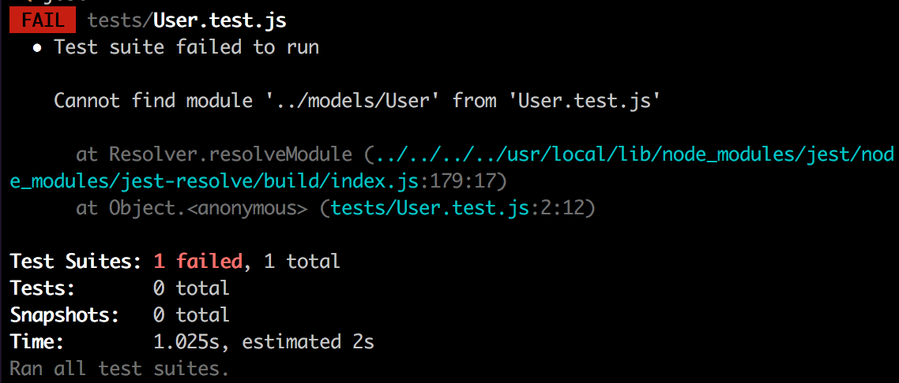
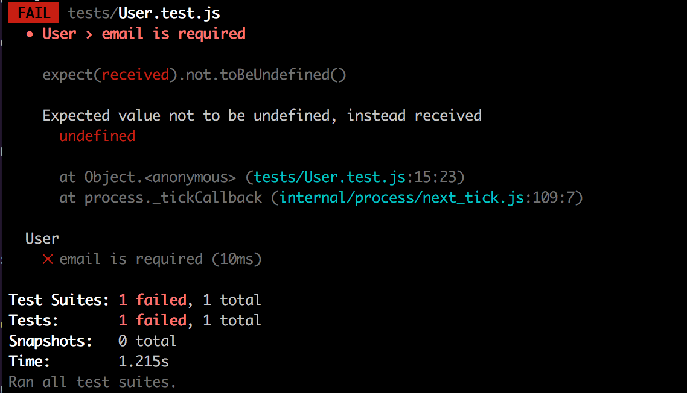
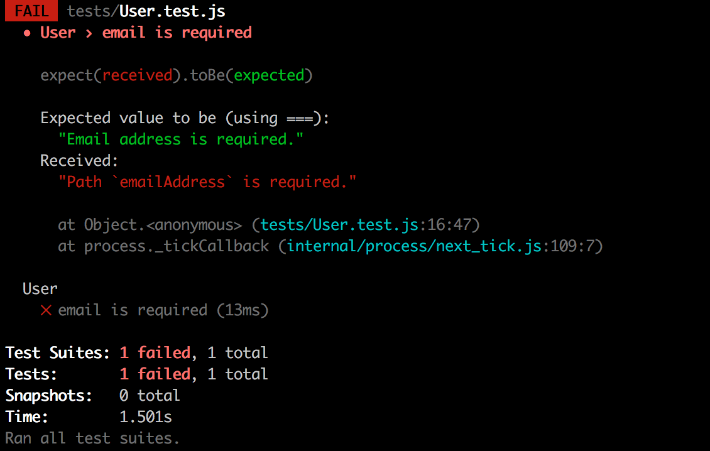

## Prep - both partners

1. Create an empty (no README) remote repository on GitHub called `social-network`.
2. Create a new folder `social-network` in your `Projects` folder, `cd` into it and initialise a new Git repository.
3. Configure the local repository to point to you and your partner's remotes:

```bash
git remote add origin <linkToYourGitHubRepo>
git remote add <partnerName> <linkToPartnerGitHubRepo>
```

:twisted_rightwards_arrows: **Decide initial driver and navigator roles between you.**

## Dependencies

1. Run `npm init` inside your project folder (enter `app.js` as the entry point).
2. Install and save to your package.json dependencies (`--save`) the `express` and `mongoose`.
3. Install and save to your package.json developer dependencies (`--save-dev`) the `jest` package.

## Testing model validations

In our Mongoose schemas, we can specify validation rules such as `min`, `max` and `required`. We want to write tests for these validation rules to ensure that they are always in place - if the rules were accidentally removed then user accounts could be created without email addresses and/or passwords (and therefore we'd be able to login without these).

### Asserting `emailAddress` is a `required` field

1. Inside your project's root folder, create a new folder called `tests`.

2. Create a new test file called `Users.test.js`.

3. Inside `Users.test.js`, require in the `Users` model from the `models/` folder (remember, we're assuming the folder and file exist as per the TDD approach - don't make it so yet) and assign it to a variable `Users`:

```js
var Users = require('../models/Users')
```

4. Underneath create a new `describe` block for `Users`. [Refresh your knowledge](https://github.com/MCRcodes/course/blob/master/week8/lesson1_part2.md).

<!-- 5. Inside the `describe` callback function block, declare a variable named `user`. Don't assign anything to it.

6. Underneath the `user` declaration - still inside of the callback function block - call `beforeEach`, passing an anonymous function as an argument to its callback parameter.

7. Inside the `beforeEach` callback function block, assign a new instance of `User` to the previously declared `user` variable.

Done? Ask for your code to be reviewed. -->

5. Now call `test` passing `email is required` as the first argument, and an anonymous function as the second argument (the callback):

```js
test('email is required', function () {

})
```

6. Inside the `test` callback block, create a new instance of the `User` model and assign it to a variable `user`.

7. Mongoose's Model object has a `validateSync` method on its prototype which will check an instance of Model against the schema and will return an error object if there are any errors, otherwise it returns undefined (you may also have guessed that there is an asyncronous method called `validate`).

Call the `validateSync` method on `user` and assign the return value to a variable `error`:

```js
var error = user.validateSync()
```

8. If there are no errors on validate (which we don't want to be the case) then `error` will equal `undefined`. Therefore, we first need to assert that `error` is `not` `toBeUndefined`:

```js
expect(error).not.toBeUndefined()
```

9. The object returned from `validateSync` that we've assigned to `error`, will have an `errors` property if there are any errors. This property will have its own object nested, where each property name is a field that errored, and the value is an object with more information on that error - we specifically want the `message` property. 

Write an assertion where you `expect` `error.errors.emailAddress.message` `toBe` `Email address is required.`.

Done? Ask for a code review.

9. Run the test. You should fail:



### Making the test pass

1. The first error we have is that there is no module `User`. Create the `models` folder in the project root folder, and inside create the `User.js` file.

2. Inside `User.js`, require in `mongoose` and assign the exported object to variable `mongoose`.

3. Underneath, create a new mongoose Schema object with an `emailAddress` field with the type of `String` and assign it to a variable `UserSchema`:

```js
var UserSchema = new mongoose.Schema({
  emailAddress: String
})
```

4. Then create a mongoose model, attach the user schema and assign to variable `User`:

```js
var User = mongoose.model('User', UserSchema)
```

5. Lastly, set the `module.exports` to `User`.

6. Run your test. You should now fail with: 



7. The reason the test is still failing is because our `user` - which we haven't specified an email address for - is valid and therefore `error` is undefined.

Remove `String` from `emailAddress` property in the `UserSchema` object and replace it with an object literal. Inside the object literal, add a property named `type` with a value of `String`. 

Add another property - still inside of the `emailAddress` object - of `required` and set the value to `true`.

8. Now run the test again:



9. The test now fails because the error message we get back is different. In Mongoose, we can specify custom error messages by wrapping our validation in an array, and passing the message as a second element in the array. Change `required: true` to `required: [true, 'Email address is required.'].

10. Run the test. It should now pass.

### Asserting `password` is a `required` field

Write a failing test to ensure the `password` field in the schema is `required`, then write the code to make it pass.

### Asserting `emailAddress` is a valid email address

We should really check that email addresses are the correct format. We can check this on the front-end in JavaScript (even in HTML5 now, by specifying `type` of `email` on an `input` element), but this can still be bypassed so we should always perform validation checks on the server to be safe. 

The most common way of checking validity of an email address is to use [Regular Expressions](https://en.wikipedia.org/wiki/Regular_expression) (or RegEx for short), whereby you match a string against a pattern. As you can see from the article though, it is very complex. Fortunately, there is an npm package called [validator](https://github.com/chriso/validator.js), which can validate values against a variety of formats including email addresses, credit card numbers and website addresses.

1. Create a new `test` inside `User.test.js` for `checks email address is valid`.

2. Inside the callback function block, create a new instance of `User` and assign it to variable `user`. Inside the `User` constructor (the parentheses), pass `{ emailAddress: 'hello!' }`.

3. Assign the return value of `user.validateSync()` to variable `error`.

4. Assert that `error` is `not` `toBeUndefined`.

5. Write an assertion where you `expect` `error.errors.emailAddress.message` `toBe` `Email address isn't valid.`.

Done? Ask for a code review.

6. Run your tests. 

7. You should fail with our `received undefined` error a.k.a there were no validation errors.

### Making the test pass

1. Install the `validator` package and save it to dependencies.

2. Inside the model file for `User`, underneath the require for `mongoose`, require in `validator` and assign the exported object to a variable `validator`.

3. In Mongoose schemas, we can specify custom validator callback functions (we pass the function definition, and Mongoose will call it when we run `validateSync`, passing the value to validate as an argument). We specify custom validate methods by adding a `validate` property to our field. The value is the callback function, or an array with the callback function and a custom error message.

Add a `validate` property to the `emailAddress` object inside the `UserSchema` object. Give it a value of: 

```js
[function (value) {
  return validator.isEmail(value)
}, 'Email address isn\'t valid.']
```

Here we create an anonymous callback function and inside return the value of `validator.isEmail(value)` which will be `false` if the email is invalid.

4. Now run your tests again. They should pass if you've done everything correctly.

## Add, commit and push

:twisted_rightwards_arrows: **Driver and Navigator switch roles**

[Next](lesson1_part3.md)