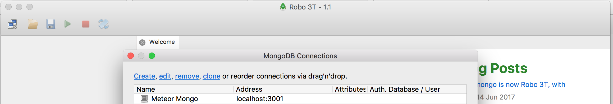

:twisted_rightwards_arrows: **Driver and Navigator switch roles if you haven't already done so**

## Connecting to the database

So far we've been able to test our code without interacting with the database. We've tested that the schema has the correct validations, that the login controller calls the login static method, and that the login static method calls Mongoose's `findOne`.

Now though we need to be able to test that a) a user can register for an account and b) that login only works with a valid account. To do this, we're going to need to connect to a test database inside of our `User.test.js` test suite. We will need to connect before each test and to ensure we always run our tests under the same conditions, we will need to wipe the database after each test.

## Creating a database

1. Firstly, you will need the `mongod` process running in the background. Please refer to [part 1](lesson1_part1.md).

2. We'll be using a GUI (graphical user interface) for MongoDB called *Robo3T* (formerly Robomongo) to create our database and to explore our data. Download it [here](https://robomongo.org/).

3. Open up Robo3T. A Connections window should popup:



4. Click the *create* link. In the window that pops up, set the *Name* to *Local Connection*. Keep the address and port as `localhost` and `27017`. Your local MongoDB process *should* already be running on this address and port. Click **Save**.

5. Your connection should now appear in the list. Select it and click **Connect**. 

6. In the sidebar you should now see your connection. Right-click the connection and select **Create Database**. 

7. Give your database a name of **social_network_test** and click **Create**.

## Connecting to the database

1. Use npm to install `dotenv` and save it to your dependencies.

2. Create a `settings.env` file in your project root. Add the following (`mongodb://<address>:<port>/<database>`):

```bash
DATABASE_URL_TEST=mongodb://localhost:27017/social_network_test
```

3. Now at the top of `User.test.js`, add the following:

```js
var path = require('path')

require('dotenv').config({
  path: path.join(__dirname, '../settings.env')
})
```

4. Underneath, require in `mongoose` and assign the exported object to a variable `mongoose`.

5. Now - inside of the describe - add the following to an anonymous function passed as an argument to `beforeAll`:

```js
beforeAll(function () {
  mongoose.connect(process.env.DATABASE_URL_TEST, {
    useMongoClient: true
  })
})
```

6. Also add to the `describe` callback block a call to `afterAll` to disconnect from the database:

```js
afterAll(function () {
  mongoose.disconnect()
})
```

## Users can register

1. Create a new test `register inserts a user with email and password`. This time, give the anonymous function callback a parameter of `done`.

2. Copy in the `user` object from the test `login requests user with matching username and password` (if you want, you could be creative and DRY, and move this `user` variable outside of the `test`):

```js
var user = {
  emailAddress: 'hello@world.com',
  password: 'password123'
}
```

3. Declare a function named `callback` and add the following to the code block:

```js
User.findOne({}, function (error, result) {
  expect(error).not.toBeTruthy()
  expect(result.emailAddress).toBe(user.emailAddress)
  expect(result.password).toBe(user.password)
  done()
})
```

Lets break that down:

* We do `findOne` on `User` to query the model's collection for one result. We pass an anonymous function as a callback to `findOne` and this gets passed an error (if there is one) and a result (the resulting document).

* We need to check there isn't an error so we expect error `not.toBeTruthy` a.k.a it's either `0`, `null`, `undefined` or `''`.

* We then expect the email address we passed into our object earlier to be the same as the one in the result. Same again for the password.

* We then call `done()`. Jest passes a function into the `test` callback that we are able to call to explicitly say when the test is done (so we decide when the test is done, not Jest). The reason being is that this test uses asyncronous code. If we don't explicitly say when the test is done, then Jest will end the test before our `findOne` query has a result.

4. Call `register` on `User` and pass in `user` and `callback` as arguments.

5. Run your tests. You should fail with: `TypeError: User.register is not a function`.

## Make the test pass

Inside `models/User.js` add a new method to `UserSchema.statics` called `register`. It should have two parameters: `user` and `callback`. Add the following code inside the code block:

```js
const newUser = new this(user)
newUser.save(callback)
```

Lets break that down:

* We call `new this` and pass in our user object from our test. `this` inside a static method refers to our constructor, so we're essentially saying `new User`.

* We then call `save` on our instance of `User`, passing in the callback that get's passed into the static method through the test. The `save` method performs the database insertion.

Run your tests. They should pass.

## Add, commit and push

:twisted_rightwards_arrows: **Driver and Navigator switch roles**

[Continue to part 7](lesson1_part7.md)