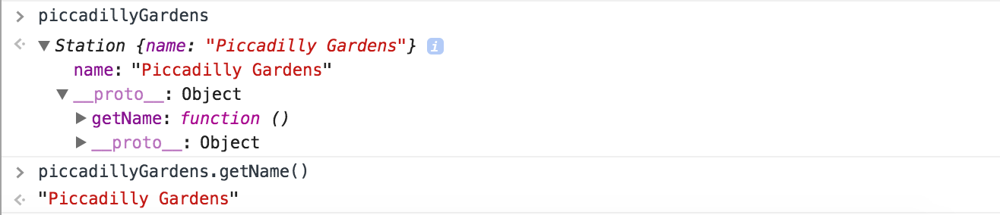

# Metrolink

We’ll be making a basic object-oriented application that will be representative of the Metrolink tram network (probably not a very accurate representation!).

We will create 3 objects for our application: `Tram`, `Station` and `Route`. We will be able to create multiple instances of each object so we will need to use the Prototype/Constructor pattern. For now, we will refrain from showing our application’s state on the DOM - our application will be accessible from the browser console only. Our application flow will look something like this:

1. Create multiple `Station` objects.
2. Create a new instance of a `Route`.
3. Add multiple `Station` instances to a `Route`.
4. Create a `Tram`, giving it a `Route`.
5. Drive the tram to the next station, unless it has reached the end of the line.
6. Check the tram’s current station.

## Prep - both partners

1. Create an empty (no README) remote repository on GitHub called `metrolink`.
2. Create a new folder `metrolink` in your `Projects` folder and initialise it as a local Git repository (`git init`).
3. Configure the local repository to point to you and your partner's remotes:

```bash
git remote add origin <linkToYourGitHubRepo>
git remote add <partnerName> <linkToPartnerGitHubRepo>
```

:twisted_rightwards_arrows: **Decide initial driver and navigator roles between you. Remember: The driver shouldn't be looking at the walkthrough, and the navigator shouldn't be typing any code!!!**

## File structure

1. Create an index.html file and populate with the basic HTML structure.
2. Create a `js/` folder and inside this folder create 3 empty files: `route.js`, `station.js`, and `tram.js`.
3. Include the files in your `js` folder into your `index.html` with `script` tags.
4. Add and commit your files to Git with an appropriate commit message.

## Creating Stations

We will have `Station`s that will be passed to `Route`s, which will be passed to `Tram`s, and therefore it makes sense to create our objects in this order.

1) Open up `js/stations.js` and define a new constructor called `Station`:

```javascript
function Station () {

}
```

2) Add a parameter of `name` to the `Station` constructor:

```javascript
function Station (name) {

}
```

3) Now we want to specify a property of `_name` that will be set when a new instance of our `Station` object is created, and we want to assign it the value of the `name` parameter:

```javascript
function Station (name) {
  this._name = name
}
```

4) Save your file, open Chrome and bring up your browser console (right-click, Inspect and Console). Define a new variable called `piccadillyGardens`, and assign it a `new` instance of your `Station` object, passing in `Piccadilly Gardens` as the constructor's `name` argument.

```javascript
var piccadillyGardens = new Station('Piccadilly Gardens')
```

5) Now type `piccadillyGardens` to get back your newly created object. You should see a `_name` property, with the value of `Piccadilly Gardens`.

***
:bulb:

You may be thinking...why is there an underscore in the property name? This is a JavaScript naming convention that indicates this property is *private* - that is, it shouldn't be **directly** accessible outside of the object.

JavaScript will still let you access these private properties outside of the object (you could for example type `piccadillyGardens._name` in the console and still get back the value) - the `_` merely indicates that you shouldn't.
***

## Stations Prototype

Okay so you've set a private property of `name` on the object. What about if you do want to retrieve the name of the station from outside the object? We know now we're not supposed to do `piccaddilly._name`, as `_name` is private. Therefore, we need to definer a `getter`. That is, a method that returns the value of one of our properties. 

1. Set the `prototype` property on `Station` to an empty object literal:

```javascript
function Station (name) {
  this._name = name
}

Station.prototype = {
  getName: function () {
    return this._name
  }
}
```

2. Inside the object literal, create a new method with the name `getName`:

```javascript
function Station (name) {
  this._name = name
}

Station.prototype = {
  getName: function () {

  }
}
```

3. Set the method to return the value of the `_name` property:

```javascript
function Station (name) {
  this._name = name
}

Station.prototype = {
  getName: function () {
    return this._name
  }
}
```

4) Save your file, open Chrome and bring up your browser console (right-click, Inspect and Console). Again, define a new variable called `piccadillyGardens`, and assign it a `new` instance of your `Station` object, passing in **Piccadilly Gardens** as the constructor's `name` argument.

```javascript
var piccadillyGardens = new Station('Piccadilly Gardens')
```

5) Now type `piccadillyGardens` to get back your newly created object. You should see a `_name` property, as before. However, if you click `__proto__` you should also see the `getName()` method. Type `piccadillyGardens.getName()`, which should return **Piccadilly Gardens**:



***
:bulb:

What is happening here? 

We've defined an object called `Station`, which has a prototype where we define our methods. Station also has a constructor, where we define the properties that **new instances** of the Station object will have. In other words, our Station object itself doesn't have properties - only methods.

When we create a new instance of our `Station` object (with the `new` keyword), our new object assigned to `piccadillyGardens` **inherits** the **constructor** of it's parent `Station` object. This constructor sets the properties of the new object, in this case it sets a `_name` property with the value of `Piccadilly Gardens` as this was the argument passed into the constructor. 

Our new object doesn't have its own methods. Rather, it **inherits** the methods from the parent `Station` object's prototype.
***

## Add, commit and push.

:twisted_rightwards_arrows: **Driver and Navigator switch roles**

[Next: Routes](lesson1_page2.md)