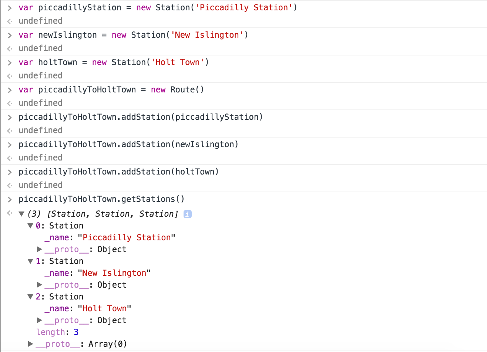

:twisted_rightwards_arrows: **Driver and Navigator switch roles if you haven't already done so**

## Routes

We now have the ability to create multiple `Station` objects. Now we need to give these `Station`s to instances of a `Route` object so our `Tram` objects will know where they're going.

1) In `route.js`, define an empty `Route` constructor and prototype, as we did for the `Station` object:

```javascript
function Route () {

}

Route.prototype = {

}
```

2) On each instance of `Route` that we create, we will need a property that stores that `Route`s stations. Let's go ahead and add a `_stations` property to the constructor. Set its value to an empty array:

```javascript
function Route () {
  this._stations = []
}

Route.prototype = {

}
```

3) Now create a new method on the `Route` prototype called `addStation`, which should have a parameter of `station`:

```javascript
function Route () {
  this._stations = []
}

Route.prototype = {
  addStation: function (station) {

  }
}
```

4) Inside the `addStation` function block, add some code that appends `station` to the `_stations` property:

```javascript
function Route () {
  this._stations = []
}

Route.prototype = {
  addStation: function (station) {
    this._stations.push(station)

    return
  }
}
```

5) Finally, add a getter method for the `_stations` property, called `getStations()`. It should return the value of `_stations`:

```javascript
function Route () {
  this._stations = []
}

Route.prototype = {
  addStation: function (station) {
    this._stations.push(station)

    return
  },
  getStations: function () {
    return this._stations
  }
}
```

## Take it for a test drive

1) Save your file, open Chrome and bring up the console. 
2) Create a few instances of `Station`, passing in a different `name` argument for each one.
3) Create a new instance of the `Route` object
4) Call `addStation` on the `Route` instance to add in each of the stations.
5) Call `getStations` on the `Route` instance to check your stations have been added.



## Add, commit and push.

:twisted_rightwards_arrows: **Driver and Navigator switch roles**

[Next: Trams](lesson1_page3.md)