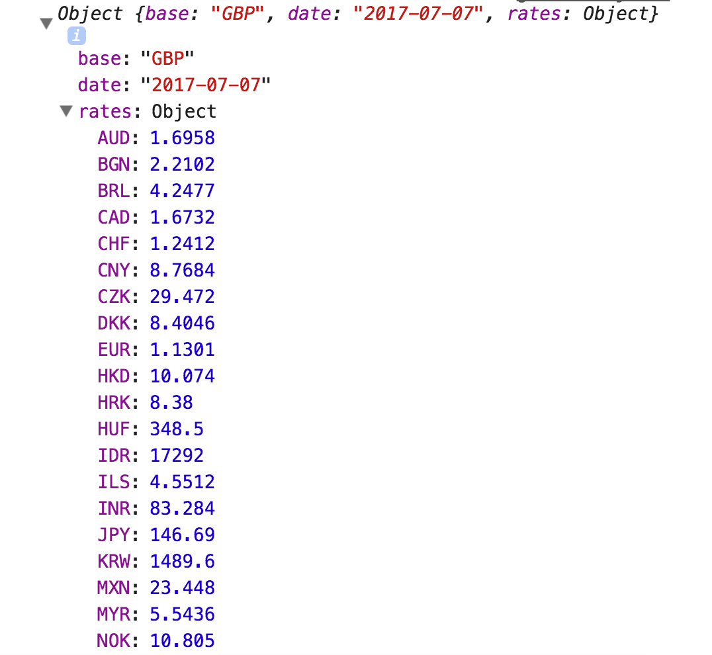

# Currency Converter

This week we'll be making a currency converter, which will allow users to specify an amount in GBP (Great British Pounds), and to convert that amount to a specified currency. 

We will be using the `XMLHttpRequest` constructor, as well as our own `CurrencyConverter` constructor to structure the application.

To begin with, we will `console.log` our application state, and then when we're happy it's working, we can work on user input forms and manipulating the DOM (for which we'll use jQuery).

## Prep - both partners

1. Create an empty (no README) remote repository on GitHub called `currency-converter`.
2. Create a new folder `currency-converter` in your `Projects` folder and initialise it as a local Git repository (`git init`).
3. Configure the local repository to point to you and your partner's remotes:

```bash
git remote add origin <linkToYourGitHubRepo>
git remote add <partnerName> <linkToPartnerGitHubRepo>
```

:twisted_rightwards_arrows: **Decide initial driver and navigator roles between you. Remember: The driver shouldn't be looking at the walkthrough, and the navigator shouldn't be typing any code!!!**

## File structure

1. Create an index.html file and populate with the basic HTML structure.
2. Create a `js/` folder and inside this folder create 2 empty files: `request.js` and `currencyConverter.js`.
3. Include the files in your `js` folder into your `index.html` with `script` tags. **IMPORTANT:** Please include `currencyConverter.js` *before* `request.js` as the latter will depend on the code of the former.
4. Add and commit your files to Git with an appropriate commit message.

## Creating a request

We will be making GET requests to the [Fixer.io](http://fixer.io/) API in order to retrieve up-to-date exchange rates.

1. Inside `request.js` create a new instance of the `XMLHttpRequest` object and assign it to a variable called `request`:

```javascript
var request = new XMLHttpRequest()
```

2. Now we need to call the `open` method, passing 2 arguments: `GET` and `http://api.fixer.io/latest?base=GBP`. This will set the internal properties of our `XMLHttpRequest` object instance:

```javascript
request.open('GET', 'http://api.fixer.io/latest?base=GBP')
```

3. When we `send` our request, we will want to handle the response. When the `XMLHttpRequest` instance has sent the request and it gets a response back, then it will call its own method `onreadystatechange`. By default, this is `null`, so we need to redefine it to handle the response. Set the `onreadystatechange` property of our object's instance (`request`) to a function (create a method):

```javascript
request.onreadystatechange = function () {

}
```

4. After our `request.onreadystatechange`, call the `send` method on our `XMLHttpRequest` instance (`request`). This will `send` the request to the server:

```
request.send()
```

5. Now before we can do something with the response, we have to ensure the server has finished responding. As more content comes back from the server, our object's `readyState` and `status` properties change. When the server has finished responding, we expect `readyState` to be `4` (done) and `status` to be `200` (ok). 

Therefore, inside our `onreadystatechange` method, we need to do a check to make sure this is the case. Create a new `if` statement that checks these properties against the expected values:

```javascript
request.onreadystatechange = function () {
  if (this.readyState === 4 && this.status === 200) {

  }
}
```

***
:bulb:

Remember, when we use `this` inside an object's method, it references that object. So to access a property inside a method we can use `this.propertyName`, or `this.methodName()` for an object's method.
***

6. Next, `console.log` out the object's `response` property:

```javascript
request.onreadystatechange = function () {
  if (this.readyState === 4 && this.status === 200) {
    console.log(this.response)
  }
}
```

7. Save your file, open up your `index.html` and look inside the console. You should see something similar to:

```
{"base":"GBP","date":"2017-07-07","rates":{"AUD":1.6958,"BGN":2.2102,"BRL":4.2477,"CAD":1.6732,"CHF":1.2412,"CNY":8.7684,"CZK":29.472,"DKK":8.4046,"HKD":10.074,"HRK":8.38,"HUF":348.5,"IDR":17292.0,"ILS":4.5512,"INR":83.284,"JPY":146.69,"KRW":1489.6,"MXN":23.448,"MYR":5.5436,"NOK":10.805,"NZD":1.7707,"PHP":65.304,"PLN":4.7828,"RON":5.1828,"RUB":77.885,"SEK":10.866,"SGD":1.7811,"THB":43.952,"TRY":4.6859,"USD":1.2897,"ZAR":17.251,"EUR":1.1301}}
```

8. You may have noticed that this is of `String` type. There is no dropdown arrow allowing us to access each property, and that is because it's not an `Object`. What the server has returned to us is **JSON**. In order to be able to work with it effectively, we therefore need to convert it to an object. We can do so with the `parse` method on JavaScript's global `JSON` object.

Define a new variable called `responseJSON` and assign to it `JSON.parse(this.response)`, and then change your `console.log` to output the value of `responseJSON`:

```javascript
request.onreadystatechange = function () {
  if (this.readyState === 4 && this.status === 200) {
    var responseJSON = JSON.parse(this.response)

    console.log(responseJSON)
  }
}
```

9. Save your file and open up your `index.html` file again in Chrome. You should now see an Object in your console. Click on the down arrow to expand it, and click on the down arrow on `rates` also. You should have something similar to this:



10. You should hopefully have an object that has a `rates` property, which is set to another object. The `base` and the `date` properties aren't important to us - we just want the object containing the exchange rates. Underneath the `responseJSON` variable you previously defined, define a new variable called `rates` and assign to it `responseJSON.rates`. Then change the `console.log` to output the value of `rates`:

```javascript
request.onreadystatechange = function () {
  if (this.readyState === 4 && this.status === 200) {
    var responseJSON = JSON.parse(this.response)
    var rates = responseJSON.rates

    console.log(rates)
  }
}
```

11. Now check your browser's console again. You should just see an object containing exchange rates:


## Add, commit and push.

:twisted_rightwards_arrows: **Driver and Navigator switch roles**

[Next](lesson1_page2.md)