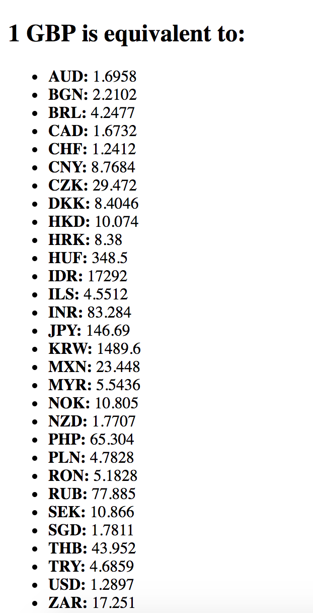

:twisted_rightwards_arrows: **Driver and Navigator switch roles if you haven't already done so**

## The CurrencyConverter object

We have successfully retrieved JSON from a remote server's API. We've parsed this JSON into a JavaScript object and we've extracted the bit we need: the exchange `rates`. 

We're going to pass this `rates` object into a `CurrencyConverter` constructor. The `CurrencyConverter` prototype will have methods that will convert the inputted currency.

1. Inside `currencyConverter.js` define a new constructor function called `CurrencyConverter`:

```js
function CurrencyConverter () {

}
```

2. Our `constructor` should have a private `_rates` property. Assign to it an empty object literal:

```js
function CurrencyConverter () {
  this._rates = {}
}
```

3. Assign an empty object literal to `CurrencyConverter.prototype`:

```js
CurrencyConverter.prototype = {

}
```

4. We have a private property of `_rates`. Therefore, we need to create a getter method to be able to access this property from outside of our object. In the prototype, define a new method named `getRates` and inside it, return the value of `_rates`:

```js
  getRates: function () {
    return this._rates
  }
```

5. Because we are handling our AJAX request outside of the `CurrencyConverter` object, we need to pass the data in - in this case, the `rates`. Therefore, as well as defining a getter method, we also need to define a setter method so we can set our `_rates` property from outside of our `CurrencyConverter` object. Define a new method called `setRates` with a single parameter of `rates`. Inside the method set the object's `_rates` property to `rates`:

```js
  setRates: function (rates) {
    this._rates = rates

    return
  }
```

6. Save the file.

## Passing the AJAX response to CurrencyConverter

We now have our request, and a CurrencyConverter object that will *eventually* handle the conversion of exchange rates. Before we go any further though, it would be a good idea to make sure what we have works.  

1. Change back to `request.js`. 

2. At the very top of the file, create a new instance of our `CurrencyConverter` object and assign it to a variable called `currencyConverter`:

```js 
var currencyConverter = new CurrencyConverter()
```

3. Now, inside the `onreadystatechange` method block, above the `console.log`, call the `setRates` method on `currencyConverter`, passing in `rates` as the argument:

```js
request.onreadystatechange = function () {
  if (this.readyState === 4 && this.status === 200) {
    var responseJSON = JSON.parse(this.response)
    var rates = responseJSON.rates

    currencyConverter.setRates(rates)

    console.log(rates)
  }
}
```

4. Next, change the `console.log` so it outputs the value of `currencyConverter.getRates()`:

```js
request.onreadystatechange = function () {
  if (this.readyState === 4 && this.status === 200) {
    var responseJSON = JSON.parse(this.response)
    var rates = responseJSON.rates

    currencyConverter.setRates(rates)

    console.log(currencyConverter.getRates())
  }
}
```

5. Save the file and open up **index.html** in Chrome. If everything is wired up correctly then you should see the `rates` object (as you did before) in the console.

## Displaying the rates on the page

Our `CurrencyConverter` object is now storing rates for us. Those rates are differing rates against the value of 1 GBP. It would be informative for our users if we shown all of these values on the front page. We will use jQuery to output this information.

1. Navigate to [https://code.jquery.com/](https://code.jquery.com/). Under *jQuery Core*, find *jQuery 3.x* and select *minified*. A modal should popup. Copy the code snippet, and add it to the bottom of your **index.html** file, above the other script tags.

***
:bulb:

What does minified mean?

Minified means that jQuery's JavaScript code has all been put onto one line with no spaces. This makes it smaller and therefore it will load onto our page faster. *Minification* is usually handled automatically. We will look at how we can minify our own files later on in the course.
***

2. Inside the `body` tags, above the `script` tags, create a new unordered list `ul` with an `id` attribute set to `rates`. Above, set some informative heading text:

```html
  <h2>1 <strong>GBP</strong> is equivalent to:</h2>
  <ul id="rates">
  </ul>
```

3. Inside **request.js**, find the `request.onreadystatechange` method and remove the `console.log`. Replace it with a `for` loop that loops through every property in `rates`, assigning the current property in the object to `rate`:

```js
request.onreadystatechange = function () {
  if (this.readyState === 4 && this.status === 200) {
    var responseJSON = JSON.parse(this.response)
    var rates = responseJSON.rates

    currencyConverter.setRates(rates)

    for (var rate in rates) {

    }
  }
}
```

***
:bulb:

We can loop through an object with:

```js
for (var property in object) {

}
```

The current property name being iterated over inside of the loop is assigned to `property`.
***

4. Finally, inside the `for` block, use jQuery's `append` method to append the rate to the DOM:

```js
request.onreadystatechange = function () {
  if (this.readyState === 4 && this.status === 200) {
    var responseJSON = JSON.parse(this.response)
    var rates = responseJSON.rates

    currencyConverter.setRates(rates)

    for (var rate in rates) {
      $('#rates').append('<li><strong>' + rate + ':</strong> ' + rates[rate] + '</li>')
    }
  }
}
```

:exclamation: Make sure you understand what this is doing before you move on!

5. Save the file and open up in Chrome. You should see something similar to:



## Add, commit and push.

:twisted_rightwards_arrows: **Driver and Navigator switch roles**

[Next](lesson1_page3.md)