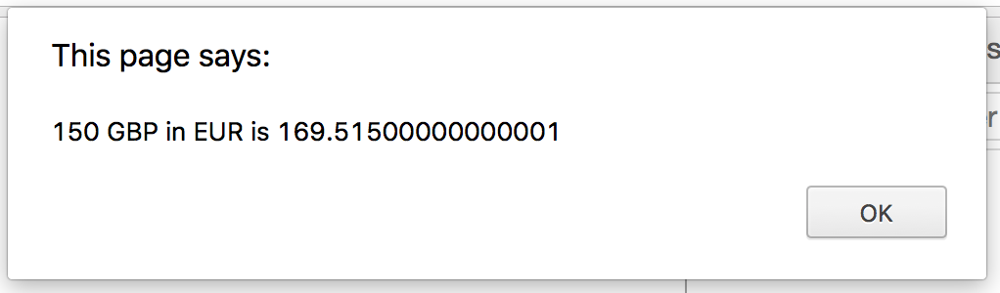

## Handling the conversion

The final part of our `CurrencyConverter` is to convert an amount from pounds to the given rate. 

1. Switch to `currencyConverter.js`.

2. Next create a method on the `CurrencyConverter.prototype` named `convertTo`, which should take two parameters: `currency` and `amount`:

```js
  convertTo: function (currency, amount) {

  }
```

3. Inside our `convertTo` method, we need to retrieve the exchange rate for the `currency` from our `_rates` object. Pass it through `Number` so we're certain it's of *Number* type before we use it later on, and assign the value to a variable named `toRate`:

```js
  convertTo: function (currency, amount) {
    var toRate = Number(_rates[currency])
  }
```

4. Now to finish the method, `return` the value of `toRate` multiplied by `amount`:

```js
  convertTo: function (currency, amount) {
    var toRate = Number(_rates[currency])

    return (toRate * amount)
  }
```

## Trying it out

1. Switch to `request.js`.

2. Inside the `onreadystatechange` method block, after the `for` block, define a new variable called `amount` and assign it a `prompt` with the argument: 'How much GBP are you looking to convert?`:

```js
request.onreadystatechange = function () {
  if (this.readyState === 4 && this.status === 200) {
    var responseJSON = JSON.parse(this.response)
    var rates = responseJSON.rates

    currencyConverter.setRates(rates)

    for (var rate in rates) {
      $('#rates').append('<li><strong>' + rate + ':</strong> ' + rates[rate] + '</li>')
    }

    var amount = prompt('How much GBP are you looking to convert?')
  }
}
```

3. Underneath, define another variable named `currency` and assign a `prompt` with the argument: `What currency would you like to convert to (enter 3 digit code in caps e.g. EUR)?`

```js
var currency = prompt('What currency would you like to convert to (enter 3 digit code in caps e.g. EUR)?')
```

4. Finally, call `alert` and pass in a string which should say '<amount> GBP in <currency> is <convertedAmount>', concetenating the variables in place of the `<>` placeholders. `convertedAmount` should come from your `currencyConverter.convertTo` method:

```js
request.onreadystatechange = function () {
  if (this.readyState === 4 && this.status === 200) {
    var responseJSON = JSON.parse(this.response)
    var rates = responseJSON.rates

    currencyConverter.setRates(rates)

    for (var rate in rates) {
      $('#rates').append('<li><strong>' + rate + ':</strong> ' + rates[rate] + '</li>')
    }

    var amount = prompt('How much GBP are you looking to convert?')
    var currency = prompt('What currency would you like to convert to (enter 3 digit code in caps e.g. EUR)?')
    var convertedAmount = currencyConverter.convertTo(currency, amount)

    alert(amount + ' GBP in ' + currency + ' is ' + convertedAmount)
  }
}
```

5. Open up Chrome. You should be confronted with 2 prompts, followed by an alert with a result:



:raised_hands: for getting this far! Add, commit and push. In the next walkthrough we'll be replacing the prompts and alerts with a form, and we'll make everything look a bit nicer.