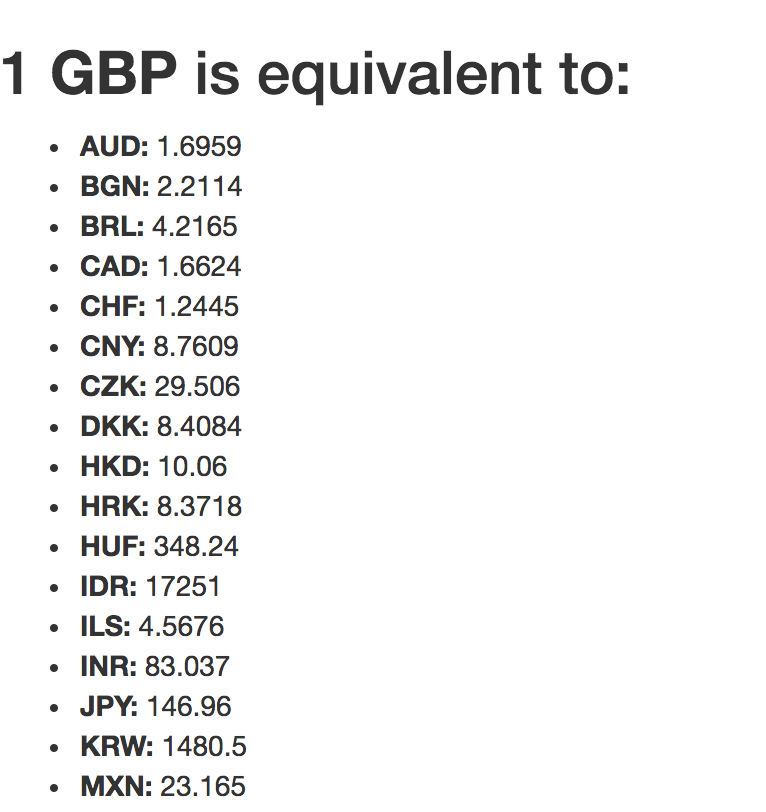
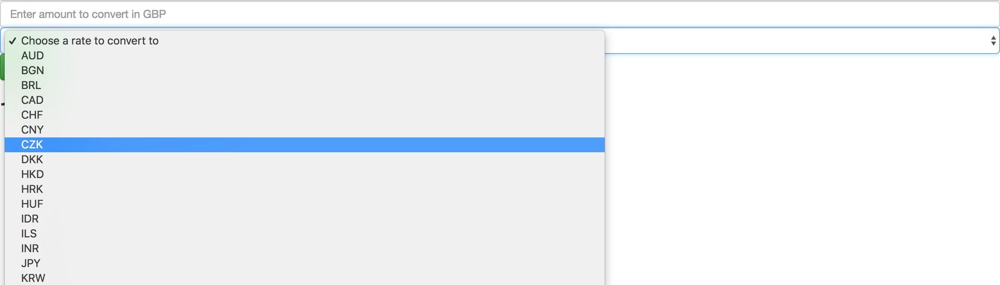
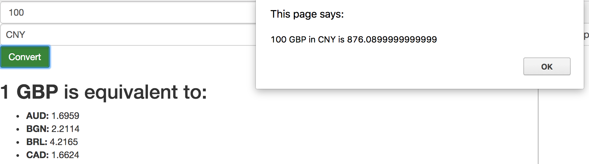

## AJAX and the DOM

We've successfully made AJAX requests to a remote server's API and we've made a simple application that will give us current exchange rates against the pound, and convert an amount our user specifies to one of those currencies.

However, much of our application still relies on alerts and prompts for user interaction, and these are generally associated with less legitimate websites. Our application also doesn't look very good at this moment in time. The alerts and prompts are also **blocking** so they're preventing the rest of the JavaScript from running until they have finished executing.

In this walkthrough, we will bring in Bootstrap to make our application a bit more aesthetically pleasing. We'll also add a form that users can use to interact with our application. We'll show a loading dialog and use our request object's `readyState` conditional logic to hide this when we have successfully retrieved a response from the server.

:twisted_rightwards_arrows: **Driver and Navigator switch roles from the last walkthrough, if you haven't already done so**

## Bootstrap

We will use Bootstrap's CSS library to provide us with some basic styling and some components.

1. Visit http://getbootstrap.com/ in your web browser. 
2. Click *Getting Started*.
3. We want to find the section headed *Bootstrap CDN*. From the code block, copy the first two `link` tags, and add them to the `head` tag in your document.
4. Open your `index.html` file in the browser. If you've included Bootstrap in properly, then your font face will have changed (usually from **Times New Roman/Linux System Default** to **Helvetica Neue**):



## Our form

We want to create a form to capture user input. We can do so with the `form` tag.

1. Inside your `body` tags, before your `script` tags, create new opening and closing `form` tags. Give the opening tag attributes of: `method` set to `post`; and `id` set to `js-convert-gbp`.

```html
<form method="post" id="js-convert-gbp">
</form>
```

2. Inside the form tags, create a self-closing (no closing tag and no `/` necessary) `input` tag. Give it attributes of: `type` with a value of `text`; `name`, with a value of `amount`; `placeholder` with a value of `Enter amount to convert in GBP`, and `class` with a value of `form-control`.

```html
<form method="post">
  <input type="text" name="amount" placeholder="Enter amount to convert in GBP" class="form-control">
</form>
```

3. After the `input` tag, create opening and closing `button` tags. Give the opening tag an attribute of `type` with a value of `submit`. Add another attribute of `class` with the value `btn btn-primary` (Bootstrap button styling). In between the two tags type `Convert`:

```html
<form method="post">
  <input type="text" name="amount" placeholder="Enter amount to convert in GBP" class="form-control">
  <button type="submit" class="btn btn-primary">Convert</button>
</form>
```

4. After the `input` tag, and before the opening `button` tag, add a set of opening/closing `select` tags. Give the opening tag an `id` attribute with a value of `ratesDropdown`, an attribute of `name` with the value `currency` and an attribute of `class` with a value of `form-control`:

```html
<form method="post">
  <input type="text" name="amount" placeholder="Enter amount to convert in GBP" class="form-control">
  <select id="ratesDropdown" name="currency" class="form-control">
  </select>
  <button type="submit" class="btn btn-primary">Convert</button>
</form>
```

5. In between the opening and closing `select` tags, add a set of opening and closing `option` tags. Between the opening and closing tag, type `Choose a rate to convert to`:

```html
<form method="post">
  <input type="text" name="amount" placeholder="Enter amount to convert in GBP" class="form-control">
  <select id="ratesDropdown" name="currency" class="form-control">
    <option>Choose a rate to convert to</option>
  </select>
  <button type="submit" class="btn btn-primary">Convert</button>
</form>
```

6. Find the `onreadystatechange` method in `request.js`. Inside the for loop we want to add another jQuery selector - this time for `#ratesDropdown` (our `select` element). We want to call the `append` method on this object also, but this time we'll append opening/closing `option` tags. The opening tag should have an attribute of `value` with a value of the `rate` variable (concatenate the strings). Between the two tags, concatenate `rate` in again:

```js
$('#ratesDropdown').append('<option value="' + rate + '">' + rate + '</option>')
```

7. Save the file and open up Chrome. After your alert, you should see your new form. The select dropdown should have currencies populated:



## Handling the form submission

Now we want to use jQuery to handle our form submission event. 

1. Create a new file in your `js` folder called `form.js`. Include the file into your `index.html` file.

2. Inside `form.js`, we want to add a jQuery event listener to the `document` to listen for when it is `ready`:

```js
$(document).ready(function () {

})
```

3. Inside the anonymous function, we want to add another jQuery event listener. Firstly, we call the jQuery constructor, passing in the id of our form, which we set to:

```js
$('#js-convert-gbp')
```

4. The above returns a jQuery object that represents the `form` element in our HTML. We can call the `submit` method on this object, passing in an anonymous callback function with a parameter of `event`:

```js
$('#js-convert-gbp').submit(function (event) {

})
```

This will attach an *event listener* to the window. When our submit button is clicked, the passed callback will be executed. jQuery passes information about the submit event to an object, which it passes as the first argument to the callback function. We can access this object with the *event* parameter (because it's a parameter, we can call it whatever we want, but *event* is usually a good choice.

***
:bulb:

We've put our event handler inside `.ready()` as a safeguard to ensure that the document has completely finished rendering before we perform the enclosed actions. As our action in this case is to immediately attach an event listener the moment the page loads, it's important we enclose this inside the `ready` callback.
***

5. A form's purpose traditionally is to send the inputted data off to a server, specified in an `action` attribute on the `form` tag. However, nowadays we typically send form data via an AJAX request. Because we haven't specified an `action` attribute, the form submission will just reload the page. If the page reloads then we lose all of our *state*. Therefore we need to *prevent the default* action of this form from taking place. The object jQuery passes to our callback function has a method called `preventDefault`. We should call this method on `event` to prevent the form from performing its default action:

```js
$('#js-convert-gbp').submit(function (event) {
  event.preventDefault()
})
```

6. Next, we want to get the values from our form inputs so we can pass this information to our `CurrencyConverter`'s `.convert` method. We can access the inputs on a form with `event.target.<inputName>.value`. First of all, define a new variable called `target` and assign to it `event.target`:

```js
$('#js-convert-gbp').submit(function (event) {
  event.preventDefault()

  var target = event.target
})
``` 

7. Underneath define two new variables: `amount` and `currency`. Assign the value `target.amount.value` to `amount`, and `target.currency.value` to `currency`. Feel free to `console.log` these variables out, and to attempt submitting the form in the browser. If all has gone well then you should see the form values in your console.

8. When the user submits the form, we want to perform the conversion logic that we previously performed inside our `onreadystatechange` callback. Inside your `request.js` file, remove the variables with `prompt`s assigned to them. **Cut** the call to `CurrencyConverter`'s `convertTo` method and the alert below and add these to your submit event handler. Your `onreadystatechange` callback should now only be responsible for displaying the rates on the DOM. Your submit event handler should look like this: 

```js
$(document).ready(function () {
  $('#js-convert-gbp').submit(function (event) {
    event.preventDefault()

    var amount = event.target.amount.value
    var currency = event.target.currency.value

    var convertedAmount = currencyConverter.convertTo(currency, amount)

    alert(amount + ' GBP in ' + currency + ' is ' + convertedAmount)
  })
})
```

9. Save the file and take it for a spin. You should no longer have prompts. Just a form that you fill in, that alerts you with a result:



## Without the Walkthrough

Use HTML elements (perhaps a Bootstrap component?) and jQuery to replace the `alert` with a message outputted on the DOM. 

[jQuery HTML Method](http://api.jquery.com/html/)

[Bootstrap Components](http://getbootstrap.com/components/)

## Add, commit and push

:twisted_rightwards_arrows: **Driver and Navigator switch roles**

[Next](lesson2_page2.md)