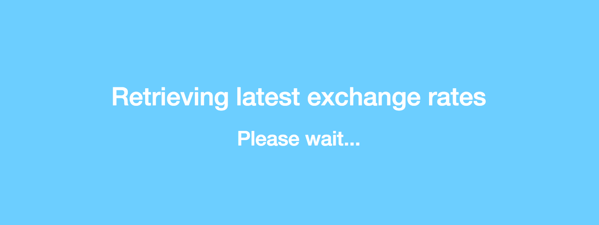
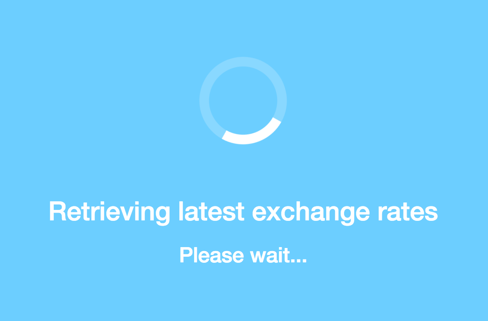
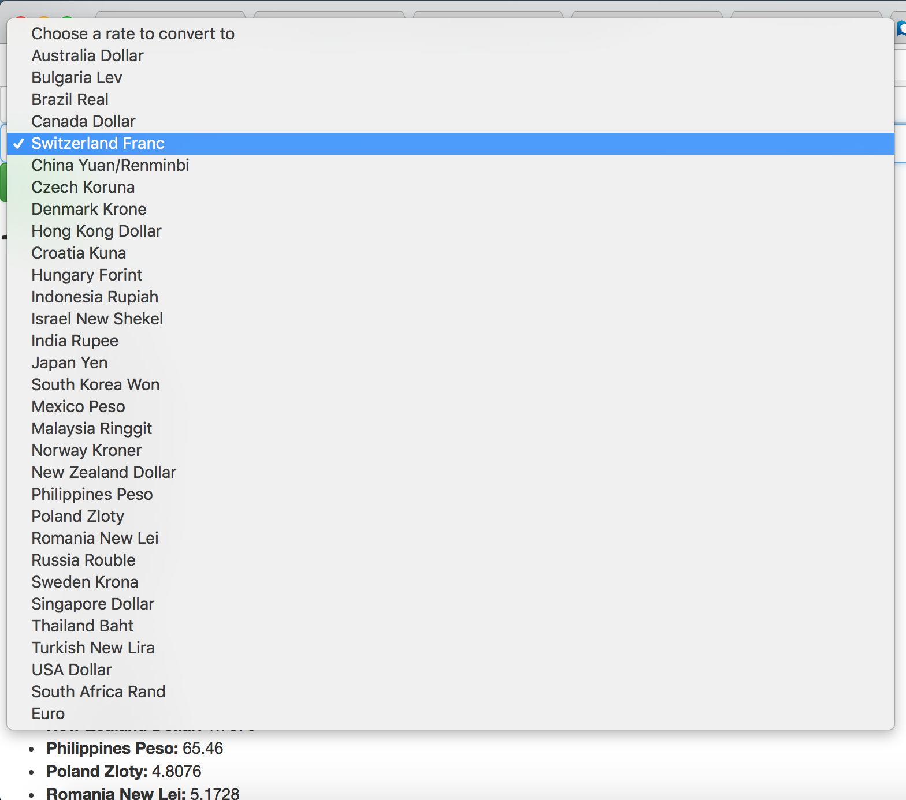

:twisted_rightwards_arrows: **Driver and Navigator switch roles if you haven't already done so**

## The loading page

You may have noticed that if the data hasn't come back from the API and you try to submit the form, that JavaScript throws an error. This is because the `CurrencyConverter`'s `_rates` property is still equal to an empty object, because its setter method hasn't been called by the `onreadystatechange` callback yet. 

What we really need is to prevent the user from accessing the form until the data has loaded. Because we're also showing the rates for 1 GBP underneath, it'd be good also if we could only show this when the data is received from the server. Ideally what we need here is to overlay a loader (similar to what you might see on comparison and travel websites when waiting for results).

## Creating the overlay

:exclamation: **The training wheels are starting to come off now. If you aren't comfortable with some of the concepts then please re-visit previous walkthroughs, use Google, discuss solutions with your pair and if you're still struggling then please ask for help.**

Our overlay will cover the entire window and will completely overlap our page's content, so the user won't see anything until we're ready for them to see it.

1. Create a **style.css** file and and include it into your **index.html** file (in the `head` tags).

2. Add a new *ID* selector named `overlay`. Inside you want to set `position` to `fixed`; `width` to `100%`; `height` to `100%`; `top` to `0`; `left` to `0`; `background-color` to `#6cceff` (or a colour of your choosing); and `color` to `white` (or a colour of your choosing).

3. Inside `index.html` - directly after the `body` tags - create a new `div` element and give it an `id` attribute with the value of `overlay`. 

4. Inside the `div` element, add a `h2` element with the text `Retrieving latest exchange rates`, and a `h3` element with the text `Please wait...`.

5. Save your files and open up your **index.html** file in the browser. You should have something similar to this:


6. Now we have an overlay and a helpful message for the user. it would be nice if the message was centered on both axis in the middle of the screen though. We can achieve this by using CSS to trick the `#overlay` element into thinking it's a table, and by nesting another `div` inside of it, which we treat like a table-cell. 

Inside your **style.css** add a property a `display` property to your `#overlay` selector, and give it a value of `table`. Create a new class selector underneath named `inner` and give it the following property/values: `display` with the value `table-cell`, `vertical-align` with the value `middle`, and `text-align` with the value `center`. 

7. Back inside your `index.html` take the contents enclosed inside the `#overlay` `div` and enclose it inside another `div` tag with a `class` attribute of `inner`. You should now have a `div` nested inside of another `div`. The parent `div` is being treated as a table and the child `div` is being treated as a table cell.

8. Refresh your browser. You should now have content aligned in the middle:



9. Now, what would make our overlay really impressive and 21st century is if we had a loading spinner above or below our informative text. Fortunately, CSS is very powerful nowadays and features some clever animation techniques. They are out of the scope of the course, but please do research into it if it's something that interests you. 

There is a website [here](https://projects.lukehaas.me/css-loaders/) that has a collection of CSS loading spinners that you can use inside of your own projects. If you click *View Source* under the spinner of your choice, then a modal will popup with the HTML and the CSS you need to include into your project. Insert the HTML inside of your `inner` div element, before or after your loading text.

10. Now when you open your browser, you may or may not (depending on whether the data comes back instantaneously) be confronted with your loading screen, until the data is ready, when it should disappear.

11. Inside your `onreadystatechange` callback, at the end of the `if` block, pass your `#overlay` tag into the jQuery selector function (`$(...)`) and call the `.hide()` method on it.

12. Save and open your file in the browser. Hopefully you have something that looks like this:



It should eventually disappear, allowing you to use your application without issues.

***
:bulb:

You may now decide you're that proud of your loading spinner that you want it to show for a few seconds even after the data comes back (a.k.a you want an *artificial* loader). If this is something you're interested in then you could consider using JavaScript's setTimeout function to defer the `$('#overlay`).hide()` call.
***

:twisted_rightwards_arrows: **If that was quite long/intense then please take a quick break and then consider swapping driver/navigator roles (add, commit and push). The next step will also be quite intense.**

## Making the currency abbreviations more informative

The data we've received from the API is *okay*. It's up-to-date and it saves us from having to manually update a set of rates ourselves every time they change (which they do...often!). However, API data isn't designed to be informative - after all it is just *data*). The more data a server sends, the more expensive it becomes to maintain the server (because pricing is usually dependant on the amount of data transferred - usually referred to as a server's *bandwidth*). Because of this, developers are more likely to be succinct and to the point when developing externally accessible APIs.

In this scenario, the big problem we have is that we only have abbreviations of currencies. I'd be very impressed if you could guess what they all were but I can't guess most of them, and I wouldn't expect you to know them either. If you don't understand the data, then how can you expect your users to understand it?

Therefore, good practice when dealing with an API is to map the JSON property names to your own data, so you output your own - more relevant - information to your application user. We can do that by creating an object, and populating that object with property/value pairs, where the property name matches the property name of the JSON object the server returns to us.

E.g if the server responds to us with some data which we parse:

```js
{
  "EUR": 1.1343,
  "USD": 1.2311
}
```

We could have an object that looks like this:

```js
var rateDefinitions = {
  "EUR": "Euro",
  "USD": "USA Dollar"
}
```

And then when we output the currencies to the user we could do something like (assuming we've parsed the JSON from above and assigned it to a variable called `rates`):

```js
for (var rate in rates) {
  $('#ratesDropdown').append('<option value="' + rate + '">' + rateDefinitions[rate] + '</option>')
}
```

***
:bulb: 

We still keep the `value` attribute as `rate` here (i.e. **EUR** or **USD**) because we still want this to match up with the `rates` objects' property names when we handle our conversion.
***

1. Create a new JS file in `js/` called **rateDefinitions.js**, and include it into your **index.html** file, before the include for your **request.js** file.

2. Inside **rateDefinitions.js** define a new variable called `rateDefinitions` and assign to it an empty object literal. Give it the following as property name/value pairs:

* **AUD**: Australia Dollar
* **BGN**: Bulgaria Lev
* **BRL**: Brazil Real
* **CAD**: Canada Dollar
* **CHF**: Switzerland Franc
* **CNY**: China Yuan/Renminbi
* **CZK**: Czech Koruna
* **DKK**: Denmark Krone
* **HKD**: Hong Kong Dollar
* **HRK**: Croatia Kuna
* **HUF**: Hungary Forint
* **IDR**: Indonesia Rupiah
* **ILS**: Israel New Shekel
* **INR**: India Rupee
* **JPY**: Japan Yen
* **KRW**: South Korea Won
* **MXN**: Mexico Peso
* **MYR**: Malaysia Ringgit
* **NOK**: Norway Kroner
* **NZD**: New Zealand Dollar
* **PHP**: Philippines Peso
* **PLN**: Poland Zloty
* **RON**: Romania New Lei
* **RUB**: Russia Rouble
* **SEK**: Sweden Krona
* **SGD**: Singapore Dollar
* **THB**: Thailand Baht
* **TRY**: Turkish New Lira
* **USD**: USA Dollar
* **ZAR**: South Africa Rand
* **EUR**: Euro

***
:bulb:

There's no reason why you can't just copy and paste the above inside your object literal, and add extra formatting to make it a valid JavaScript object.

Another pointer - if you hold the *Alt* key in VS Code and click on different bits of code, you can insert the typing cursor in multiple places (a.k.a you can type in many places at once).
***

3. A `rateDefinitions` variable should now exist on the global `window` object, which means we can access it inside our other JS files. Change to `request.js` and find the `for` loop inside the `onreadystatechange` callback. Amend the strings passed to your `append` methods so that the text displayed to the user is evaluated from `rateDefinitions[rate]`. We're still using our `rate` variable, but it evaluates inside the square brackets (square bracket notation) to whatever its value is (e.g. `EUR`) and then that text string is passed to the object, a matching property name is found, and the value is returned. The value in this case is our long string i.e. `Euro`. 

**Don't** change the `value` attribute on the `option` tag - keep it as the `rate` variable. We still access this value with `event.target.rate.value` inside our `form.js`'s submit event, and we expect the value (i.e. `EUR`) to match up with our parsed JSON object's property names).

4. If you've wired everything up correctly, you should see the following in your browser:



## Add, commit and push

:twisted_rightwards_arrows: **Driver and Navigator split. You can ride solo for the next section.**

[Next](lesson2_page3.md)