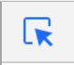
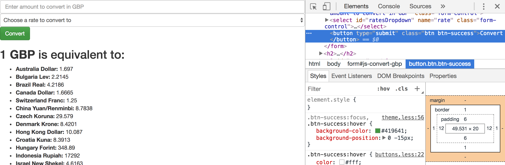
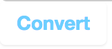

## Deploying to GitHub Pages

This should be your first useful *polished* project, and therefore it would be good if it was available online for others to look at. Fortunately, GitHub offer a service called *GitHub Pages* that allows us deploy basic HTML/JavaScript projects online by pushing to a GitHub repository. You are allowed one website per GitHub account (don't create multiple accounts - there are other ways to host websites).

1. Go to [GitHub](https://github.com/) and click the **+** at the top and **New Repository**. 

2. **IMPORTANT**: To tell GitHub you want a repository to be deployed online, you have to name it *username*.github.io where username is your GitHub username.

3. Once you've given your repository its name, click **Create Repository**.

4. Now you'll want to add a new remote to your existing local repository that points to the new repository. Inside the command line, whilst in your **currency-converter** project folder type the following:

```bash
git remote add deploy <https://github.com/username/username.github.io>
```

The URL above should match your newly created GitHub repository.

5. Now `git push` to your new remote:

```bash
git push deploy master
```

In anything up to 30 minutes time (it sometimes takes a while for your changes to propogate through GitHub's servers - you may be able to see it straight away) you should be able to see your project online by visiting *username*.github.io in your browser. 

Every time you make a change locally now, view the file inside your web browser and check *very carefully* (let's at least pretend we have many thousands of users relying on us to ensure our application works) that you're happy it works as it should. If it does then add and commit changes, and push up to your `deploy` remote.

***
:bulb:

If your website shows up and stays on the loader then you may well have a HTTPS error. If you open up your console you may see: `Mixed Content: The page at 'https://<username>.github.io/' was loaded over HTTPS, but requested an insecure XMLHttpRequest endpoint 'http://api.fixer.io/latest?base=GBP'. This request has been blocked; the content must be served over HTTPS.` If this is the case, then change your URL inside **request.js** to point to `https://api.fixer.io/latest?base=GBP` (`https` protocol instead of `http`). 

The reason this error is occurring is that with the **HTTPS** protocol, every resource we show (i.e. images) or request (i.e. GET requests) on our webpage also has to use the **HTTPS** protocol. This is because data is encrypted when transmitted across HTTPS making it more secure than HTTP (you may see a padlock icon in your address bar - especially on shopping (e-commerce) websites). 
***

***
:bulb:

If you are serious about a career in tech then I would very much consider allocating your GitHub pages account to an online portfolio website of your work. GitHub even allows you to [use your own domain name](https://help.github.com/articles/using-a-custom-domain-with-github-pages/).
***

## Making it unique

By now, you likely have a fully usable and deployed web application. It still uses the default Bootstrap theme though. This is fine, but we ideally want to make our applications look unique. 

Remember that you can use the arrow button (ask if you're unsure) inside the console to select elements and view the CSS associated with them. You can copy the selector names into your **style.css** and specify your own property/value pairs to style each element. As long as your CSS file is included in **after** the Bootstrap CSS library, and your selector is as specific as Bootstrap's, then your CSS should take priority (due to CSS's cascading nature).

Example - styling a button:

Click the 'arrow' icon:



Click on your **Convert** button. Inside the inspector you should see the corresponding HTML element in the page source, and the CSS selectors that apply to that element below:



Scroll down through the CSS selectors, modify the values in Chrome (by clicking on the value) and see how they affect the element on the page. You can also click the checkbox to the left of each property/value pair to comment/uncomment it (i.e. stop it from having any effect). These changes won't be saved to your file. When you're happy with the properties you've changed, find the selector name, copy it into your **style.css** file and provide the property name/value pair to add or override. 

Example:

```css
.btn-success {
  background-image: none;
  background-color: white;
  color: #6cceff;
  font-weight: bold;
  text-shadow: none;
  border: 0;
}
```

will change:


to:



As a **bare minimum** you should style your body tag to add some `margin` to your page so the form inputs aren't touching the sides of the page. It would also be nice if there was `margin` between the `form-control` elements.

If you want to go further - and by all means you should - then add more Bootstrap components to the page such as panels and play around with colours a bit more.

***
:bulb:

A couple of useful tools if you want to make a website look nice but aren't so great on the colour choices (I use them frequently):

* [Coolors.co](https://coolors.co/) - Generates a palette of 5 complementing colours that you can use to style your website.
* [0to255.com](http://www.0to255.com/) - You input a colour and get back lighter and darker colours (like a B&Q colour palette). Great for hover effects.
***

## Optional - Edge cases

Edge cases are the things that could happen in our application that we should prevent from being allowed. In the case of our currency converter, our user can still submit the form - even if they haven't provided an amount to convert or a currency to convert to (we haven't added conditional logic to our `submit` event handler to handle *edge cases*).

Inside your `submit` event handler, add an `if` statement to check that if the `amount` and `rate` values are falsy. If they are then `return` from the function (you can also append an error message to the DOM if you wish to inform the user their action is invalid).

## Exemplar


There is an exemplar currently hosted on my GitHub Pages account's repository [here](https://github.com/joestephens/joestephens.github.io).