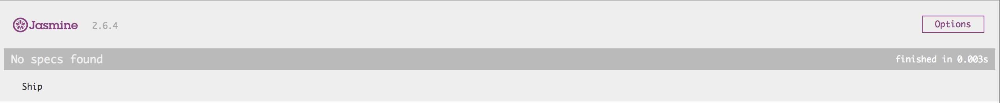
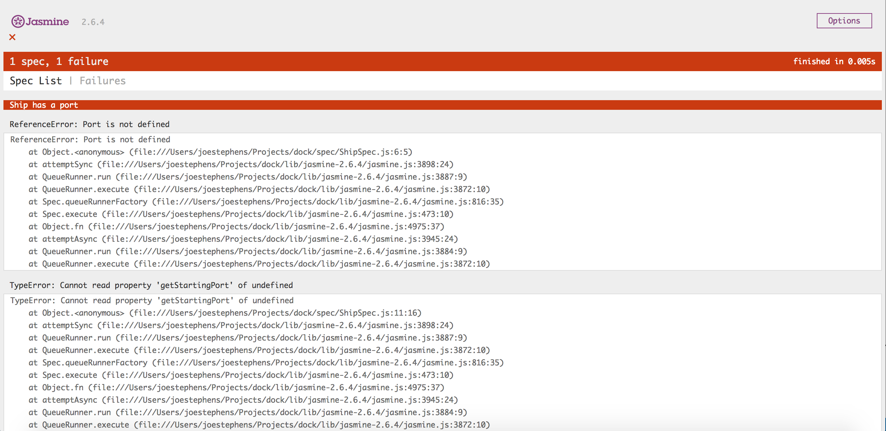
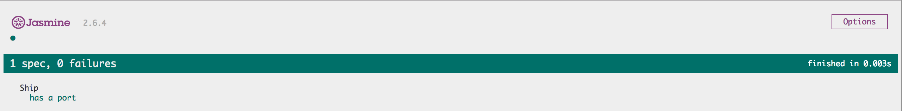

## Test Driven Development (TDD)

In Test Driven Development, you write a test for your code before you write the code itself (you have to preempt the code you're going to write). We write tests for our *units* - the units being the methods inside our objects. 

In this walkthrough we'll use Jasmine to test our methods (that we haven't written yet), and then once we've ran the test (and it fails), then we will write the code to make it pass. Our methods will all have `return` values so we have something to test against.

This week we are going to make a `Dock` that can take `Ship` objects. There will be multiple `Dock`s that can take multiple `Ship`s, and our `Ship` will be able to sail to other `Dock`s. We won't be rendering anything to the DOM this week - we're purely going to create objects with methods that have return values and we'll be testing those return values.

## Prep - both partners

1. Create an empty (no README) remote repository on GitHub called `dock`.
2. Create a new folder `dock` in your `Projects` folder and initialise it as a local Git repository (`git init`).
3. Configure the local repository to point to you and your partner's remotes:

```bash
git remote add origin <linkToYourGitHubRepo>
git remote add <partnerName> <linkToPartnerGitHubRepo>
```

:twisted_rightwards_arrows: **Decide initial driver and navigator roles between you. Remember: The driver shouldn't be looking at the walkthrough, and the navigator shouldn't be typing any code!!!**

## Initial setup

1. First we need to download Jasmine. Please download from [here](https://github.com/jasmine/jasmine/releases/download/v2.6.4/jasmine-standalone-2.6.4.zip).
2. Extract the contents into your Projects folder (you should now have `~/Projects/jasmine-standalone-2.6.4`).
3. In the command line, `cd` into your `Projects` folder and do:

```bash
mv jasmine-standalone-2.6.4 dock
``` 

4. Now change directory into `dock` (`cd dock`) and open up VS Code (`code .`).
5. Delete the files in `spec/` and `src/` (so you're left with 2 empty folders).
6. Open up `SpecRunner.html` and remove the `script` tags under `<!-- include source files here... -->` and `<!-- include spec files here... -->`.

## Folder structure

You should now have the following folder structure:

```
lib/
  jasmine-2.6.4/
    ...
spec/
src/
MIT.LICENSE
SpecRunner.html
```

The `lib` folder is where the Jasmine library's files are stored (`lib` is short for libraries).

The `spec` folder is where we will store the JS files for our tests.

The `src` folder is where we will store the JS files for our application code (that will make the tests pass).

## Add and commit - don't swap roles yet

## Writing our first test

```
As a ship captain,
So I can get on my ship,
I want my ship to have a starting port.
```

1. Create a new file inside `spec/` called `ShipSpec.js`.
2. In `SpecRunner.html`, include the file in under `<!-- include spec files here... -->`.
3. Jasmine has a `describe` function for grouping tests. It takes two arguments: a description for the test; and a callback function where our tests will go. Go ahead and add a call to `describe` in `ShipSpec.js`, passing `Ship` as the description and an anonymous function as the callback:

```js
describe('Ship', function () {

})
```
4. Open up `SpecRunner.html` in Chrome. You should see the following:



*Ship* is the description we gave in step 3. It says `No specs found`, because we haven't actually written any tests yet.

5. Jasmine has a function called `beforeEach` that takes a single parameter of a callback function. Inside the anonymous function passed to `describe`, call the `beforeEach` function, passing it an anonymous function:

```js
describe('Ship', function () {

  beforeEach(function () {

  })

})
```

The purpose of `beforeEach` is to specify a block of code to run before each test. We will use it to create new instances of the objects we will use in our tests.

6. Inside `describe`'s anonymous function, define two new variables: `port` and `ship`. Don't assign them values. Inside the `beforeEach`: create a new instance of `Port` and assign it to the `port` variable; create a new instance of `Ship` and assign it to the `ship` variable; and finally pass `port` into the `Ship` constructor:

```js
describe('Ship', function () {

  var port
  var ship

  beforeEach(function () {
    port = new Port()
    ship = new Ship(port)
  })

})
```

Because we're only going to set the starting port of a ship once - and this will likely be when we first create an instance of `Ship` - then it makes sense to set this in the `Ship`'s constructor, hence we've passed `port` into the constructor above.

If you open up `SpecRunner.html` you will notice this has had no effect whatsoever. That's because the `beforeEach` function hasn't been called yet, as we still don't have a test.

***
:bulb:

Here we store our variables in memory but don't assign them a value. That's because we only intend to assign values to them inside the `beforeEach` callback, yet we need to access them inside other functions. If you define a variable inside a function then it only has scope inside of that function, but if you define the variable outside of a function then you can look outside of the function for that variable. This is known as *hoisting*. 
***

7. We can use Jasmine's `it` function for the actual test itself. `it` takes two arguments: a description of the test; and a callback function. Underneath the `beforeEach` block, add a call to `it`, passing `has a starting port` as the first argument, and an anonymous function as the second argument:

```js
describe('Ship', function () {

  var port
  var ship

  beforeEach(function () {
    port = new Port()
    ship = new Ship(port)
  })

  it('has a starting port', function () {

  })

})
```

8. Now we have a test, we need to add an *assertion*. Assertion's assert whether a method's return value is what we expect it to be. We can pass our method calls into Jasmine's `expect` function, which returns an object with assertion methods. The assertion method we will use is `.toBe`, which takes a single argument: the value we expect our method to return. Go ahead and add the following:

```js
  it('has a starting port', function () {
    expect(ship.getCurrentPort()).toBe(port)
  })
```

So we **expect** our `ship`'s (instance of `Ship`) `getCurrentPort` method to return a value that is equal to (`toBe`) `port`.

9. Open `SpecRunner.html` in Chrome. You should see the test failing:



10. We refer to this list of errors as a *stack trace*. The top of the stack trace is the first error that the JavaScript interpreter encountered, therefore we will fix this first (as it may be the cause of any following errors). Our first error states: `ReferenceError: Port is not defined`. `Port` isn't defined, because we haven't wrote any code yet! Now our test is telling us we need to. 

Create a `Port.js` file in `src/` and create a new constructor and prototype for `Port`. Include the newly created `Port.js` file into your `SpecRunner.html` under `<!-- include source files here... -->`.

11. Run your tests (open `SpecRunner.html` in Chrome again). The error at the top of our stack trace is now: `ReferenceError: Ship is not defined`. Go ahead and repeat the instructions from step 10 for `Ship`.

12. Refresh your `SpecRunner.html`. The only error you should have now is `TypeError: ship.getCurrentPort is not a function`. Our test is now instructing us that we need to make a `getCurrentPort` method on the `Ship` prototype. Go ahead and create this method in `Ship.js` in your prototype. Leave it empty - we only want to fix the current error, which is that the method doesn't exist:

```js
getCurrentPort: function () {

}
```

13. Run your tests again. You should have a new error `Error: Expected undefined to equal Object({  })`. Jasmine is telling us that firstly the return value of our `getCurrentPort` method is undefined (`ship.getCurrentPort` has evaluated to `undefined` inside the `expect` function). Secondly, it's telling us that it's expecting an object, which is correct - we are asserting against the `port` object. 

## Make that test pass!!!

Let's make this test pass (I bet you're thinking *finally*). 

1. Add a `port` parameter to the `Ship` constructor, then inside the constructor block, create a property named `_currentPort` and set it equal to `port`. 

2. Inside the `getCurrentPort` method, return the value of the `_currentPort` property.

3. Run your tests again. If you've done everything correctly, you should see:



:tada:

## Add, commit and push.

:twisted_rightwards_arrows: **Driver and Navigator switch roles**

[Continue to Part 2](lesson1_page2.md)