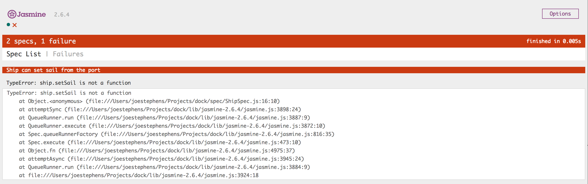
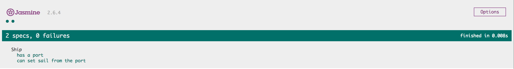

:twisted_rightwards_arrows: **Driver and Navigator switch roles if you haven't already done so**

## Sailing from a port

```
As a ship captain,
So I can get holidaymakers on their way to their destination,
I want my ship to set sail from the port.
```

When we sail from a port, the `_currentPort` of `ship` won't be anything - it's sailing! Let's go ahead and write a test for this.

1. Inside `ShipSpec.js`, add a new `it` block, with the description `can set sail from the port`:

```js
it('can set sail from the port', function () {

})
```

2. Inside the function block, call `setSail` on `ship`:

```js
it('can set sail from the port', function () {
  ship.setSail()
})
```

3. Now we want to assert that the ship's `_currentPort` is a falsy value. We can pass `getCurrentPort` to `expect` as we did before, but for our assertion we can use the `.toBeFalsy()` method:

```js
it('can set sail from the port', function () {
  ship.setSail()

  expect(ship.getCurrentPort()).toBeFalsy()
})
```

4. Now run your tests. You should have an error:



5. Jasmine is telling us `ship.setSail` isn't a function. This is enough instruction to create a `setSail` method on our `Ship` prototype. Go ahead and add the method (but leave it empty!). 

6. Run your tests again. You should see: `Expected Object({  }) to be falsy.`. We're expecting an object to be falsy, which means a port object is still assigned to `_currentPort`. Inside your `setSail` method, set the `_currentPort` property to `null`:

```js
  setSail: function () {
    this._currentPort = null

    return
  }
```

7. Run your tests again. You should be passing:



## Sailing to a port

We now have a ship that can set sail, but we don't have any way of docking it. 

1. We want to dock our ship at a different port from the port we set sail from. Therefore, above the `beforeEach` callback, define another variable called `arrivalPort` and inside the `beforeEach` callback, set it to a new instance of `Port`:

```js
  var port
  var arrivalPort
  var ship

  beforeEach(function () {
    port = new Port()
    arrivalPort = new Port()
    ship = new Ship(port)
  })
```

2. Time to create another test. Add a new `it` call and pass in the description `can dock at a port`:

```js
it ('can dock at a port', function () {

})
``` 

3. Inside the anonymous function block, call the `dock` method on `ship` and pass in `arrivalPort`:

```js
it ('can dock at a port', function () {
  ship.dock(arrivalPort)
})
``` 

4. Underneath create a new expectation, passing in `ship.getCurrentPort()`, and assert that the returned value is equal to `arrivalPort`:

```js
it ('can dock at a port', function () {
  ship.dock(arrivalPort)

  expect(ship.getCurrentPort()).toEqual(arrivalPort)
})
``` 

5. Run the tests and watch it fail! `TypeError: ship.dock is not a function`.

## Without the Walkthrough

Write some code (don't modify the test!) to make the above test pass.

## Add, commit and push.

:twisted_rightwards_arrows: **Driver and Navigator switch roles**

[Continue to Part 3](lesson1_page3.md)