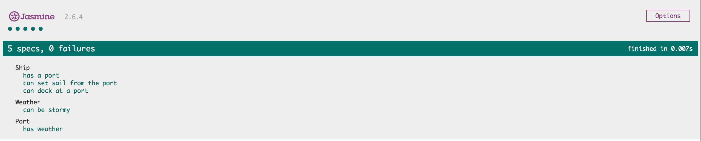
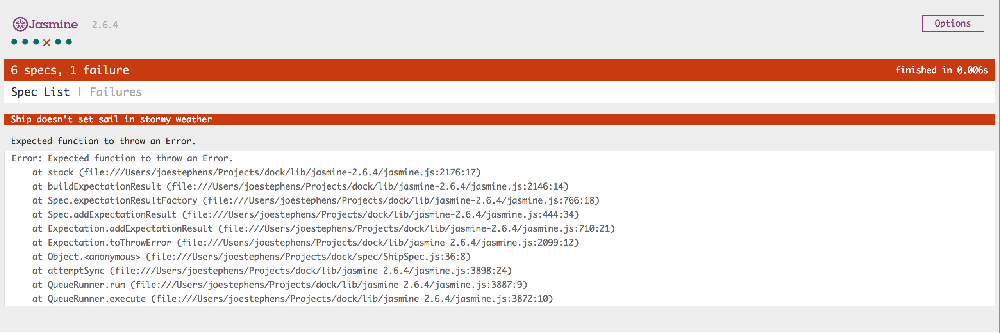

:twisted_rightwards_arrows: **Driver and Navigator switch roles if you haven't already done so**

## I don’t want my ship to set sail if the weather is stormy

```
As a ship captain,
To ensure the safety of my passengers,
I don’t want my ship to set sail if the weather is stormy.
```

We've created a `Weather` object, but we haven't actually implemented our user story, which states that our ship can't set sail in stormy weather.

The dilemna now is that we will need to give a `Ship` access to the `Weather` object so it can make that decision, but it doesn't make sense for a `Ship` to have `Weather`. It makes more sense that a `Port` would have `Weather`. 

## Ports have Weather

1. Create a new file called `PortSpec.js` in your `spec/` folder, and include it into your `SpecRunner.html` in the appropriate place.
2. Add a new call to `describe` with `Port` as the first argument and an anonymous function as the second argument:

```js
describe('Port', function () {

})
```

3. Inside the `describe` callback, declare two variables: `weather` and `port`.

4. Add a `beforeEach` to the `describe` callback, passing in an anonymous function. Inside the anonymous function, instantiate a new `Weather` object and assign it to `weather`, and instantiate a new `Port` object and assign it to `port`, passing in `weather` into the constructor:

```js
describe('Port', function () {
  var weather
  var port

  beforeEach(function () {
    weather = new Weather()
    port = new Port(weather)
  })
})
```

5. Now add a new test (`it`) with a description `has weather`:

```js
it('has weather', function () {

})
```

6. Inside the callback `expect` `port.getWeather()` `toBe` `weather`:
```js
it('has weather', function () {
  expect(port.getWeather()).toBe(weather)
})
```

(Notice how that code almost reads like plain English. It's why we use meaningful names for our variables, functions and objects!)

7. Run your tests. You should have `TypeError: port.getWeather is not a function`. Go ahead and add the method to your `Port` prototype.

8. You should now have a new error: `Expected undefined to equal Object({ _NOT_STORMY_PROBABILITY: 0.5 }).`. Lets add code to `Port.js` to make our test pass. The constructor should have a parameter of `weather`. Set a property of `_weather` and assign to it the weather `parameter`:

```js
function Port (weather) {
  this._weather = weather
}
```

9. Now inside the `getWeather` method, return the value of `_weather`:

```js
  getWeather: function () {
    return this._weather
  }
```

10. Run the tests:



## Ships have Ports that have Weather

Now we can finally add tests to our `ShipSpec.js` to ensure ships don't sail in stormy weather. 

1. First of all, In `ShipSpec.js` declare a new `weather` variable at the top of the `describe` callback, and modify the `new Port()` constructor assigned to `port` so you are passing in the `weather` variable:

```js
  var weather
  var port
  var arrivalPort
  var ship

  beforeEach(function () {
    weather = new Weather()
    port = new Port(weather)
    arrivalPort = new Port()
    ship = new Ship(port)
  })
```

2. Add a new test `doesn't set sail in stormy weather`:

```js
  it('doesn\'t set sail in stormy weather', function () {

  })
```

3. Now we need to `spyOn` `weather` `isStormy` `and` `returnValue` `true`:

```js
  it('doesn\'t set sail in stormy weather', function () {
    spyOn(weather, 'isStormy').and.returnValue(true)
  })
```

***
:bulb:

Before, we had to `spyOn` `Math.random()`. This was to ensure that aside from the `Math.random()`, we were testing as much of the `isStormy` method as possible. Because we're happy we have tests for the `isStormy` method, we can now confidently override its return value directly inside our other spec files.
***

4. Finally, add an assertion to the test that `expect`'s `ship.setSail()` `toThrowError('cannot sail in stormy weather')`:

```js
  it('doesn\'t set sail in stormy weather', function () {
    spyOn(Weather, 'isStormy').and.returnValue(true)

    expect(function () {
      ship.setSail()
    }).toThrowError('cannot sail in stormy weather')
  })
```

***
:bulb:

Here we've had to wrap our `ship.setSail()` in an anonymous function. The reason is that we're expecting our code to throw an error - if `ship.setSail()` is allowed to run immediately then it will throw an error **before** Jasmine can assert an error has been thrown. The issue here is that the error will throw and halt the execution of the code, so Jasmine won't be able to run its assertions. By passing the method in an anonymous function, Jasmine will decide when it is called.
***

5. Run your tests. You should fail:



6. Now we need to modify `setSail` with an `if` statement that checks its port's weather:

```js
  setSail: function () {
    if (this.getCurrentPort().getWeather().isStormy()) {
      throw new Error('cannot sail in stormy weather')
    }

    this._currentPort = null

    return
  }
```

:exclamation_mark: **This is a long object chain. Make sure you understand what is going on before you go further.**

***
:bulb:

Throw!? [Throw on W3Schools (basic explanation)](https://www.w3schools.com/jsref/jsref_throw.asp) or [Throw on MDN (detailed explanation)](https://developer.mozilla.org/en-US/docs/Web/JavaScript/Reference/Statements/throw)
***

7. Now if you run your tests, they might pass. They might not. The reason they might still be failing is `Error: cannot sail in stormy weather`. The test that is actually failing is `Ship can set sail from the port` (look closely at the test runner). The reason it's failing is because sometimes the weather will be stormy, causing `setSail` to throw. Add a `spyOn` to the top of this test that sets `weather` `isStormy` to `false`:

```js
  it('can set sail from the port', function () {
    spyOn(weather, 'isStormy').and.returnValue(true)

    ship.setSail()

    expect(ship.getCurrentPort()).toBeFalsy()
  })
```

8. Run your tests. You should be green again.

## Add, commit and push.

:twisted_rightwards_arrows: **Driver and Navigator switch roles**

[Continue to Part 5](lesson1_page5.md)