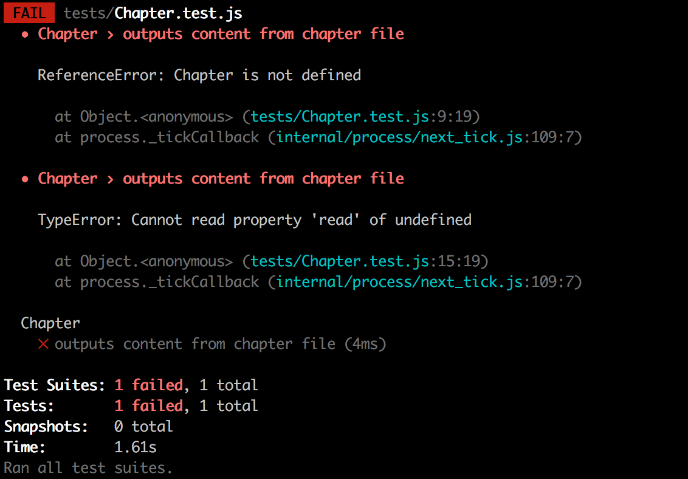
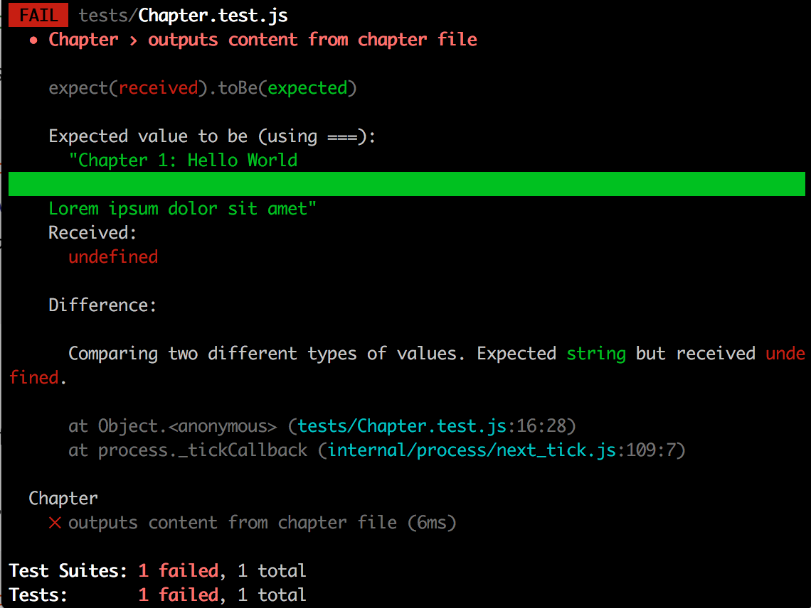
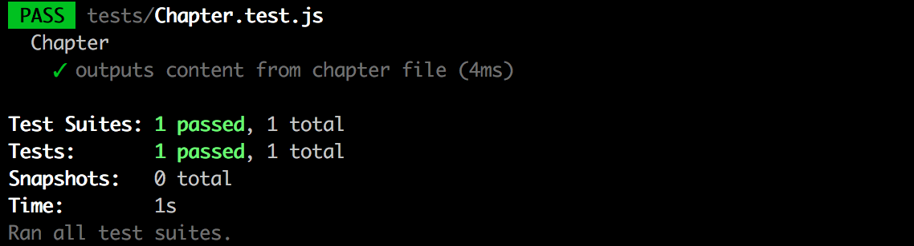

:twisted_rightwards_arrows: **Pairing starts now. Please decide driver/navigator roles**

## Initial structure

Our e-reader application will have two books available (courtesy of [Project Gutenburg](https://www.gutenberg.org/wiki/Main_Page)): *Alice's Adventures in Wonderland* by *Lewis Carroll* and *The Adventures of Sherlock Holmes* by *Arthur Conan Doyle*.

To save the hassle of having to download these books and split them into different text files etc., a repository has been created which contains directories for each book, with each directory containing a `.json` file with the contents of the book, and several `.txt` files containing the chapters themselves.

1. `cd` into your `Projects` folder and clone the repository:

```
git clone git@github.com:MCRcodes/kindle.git
```

2. `cd` into the `kindle` folder, and `rm -rf .git` to remove the Git repository. You should just have a project folder with the `/books` folder in.

3. Initialise a new Git repository in the folder.

4. Add yours and your partner's remotes.

## .gitignore

We need to ignore the `/node_modules` folder that gets created when we use npm to install dependencies. To do so, create a new `.gitignore` file (no extension) inside your project root folder and add:

```
node_modules/
```

## Testing - Installing Jest

For our unit tests, we are going to be using the test runner [Jest](https://facebook.github.io/jest/). *Jest* has a similar syntax to Jasmine, but is intended to run on Node.js (and as such, we run our tests in the command line).

1. Inside your project folder, use `npm` to create a new package.json file:

```
npm init
```

Set the `entry point` to `app.js`, the `test command` to `jest` and you can optionally fill in the `author` and `description`.

2. Now use `npm` to install the `jest` package and save it to **developer** dependencies:

```
npm install --save-dev jest
```

***
:bulb:

`--save-dev` will save a package to package.json under `devDependencies`.

Why are we adding `jest` to `devDependencies` in our package.json file and not `dependencies`? The reason is that if we are deploying our application to a server, then we won't want to push our test suite library up with the codebase, as we only want to run tests on our code in our *development environment* - that is on our computers we use to develop - so we'd want `jest` to be part of our `devDependencies`. 

However, we'll want libaries such as `jQuery` on our normal `dependencies`, as we will want these available on our *production environment* - that is the server that will serve up our application.

When we run `npm install` to install packages in a package.json, then it will install both `devDependencies` and `dependencies`, **but** it is possible to install one or the other (we won't go into this now), hence we seperate our dependencies, so we only ever install the ones we need for the environment we're on.
***

3. We also want to be able to use the `jest` command in the command line. To do this, we need to install `jest` globally (`-g`) (driver and navigator will need to do this):

```bash
npm install -g jest
```

If the above doesn't work, try running: 

```bash
sudo npm install -g jest
```

***
:bulb:

sudo means: run command as administrator.
***

## Creating our first test

```
As a person,
So I can entertain myself,
I would like to read a chapter of a book.
```

We can run tests for our application by typing `jest` in the command line. At this moment it should come back with `No tests found`.

1. Create a folder called `tests`.

2. Inside `tests`, create a new folder called `fixtures`, and inside `fixtures`, create a new file called `sampleChapter.txt`. Copy and paste in the following:

```
Chapter 1: Hello World

Lorem ipsum dolor sit amet
```

***
:bulb:

What are *fixtures*? A fixture is a sample piece of data that we can use in our tests. It matches the format that the real data our application uses will. The benefit of using a fixture over real data is that we know it will always be there and won't change.
***

3. Back inside the `tests` folder, create a file called `Chapter.test.js`.

***
:bulb:

The Jest test runner considers either of the following to be a test file (when you run the `jest` command, it searches for and executes these files):

* Any file in a `__tests__` folder
* Any file ending in `.spec.js` or `.test.js`
***

2. We can create a grouping for our tests with the `describe` function (same as how we would in Jasmine). Call `describe` with `Chapter` and an anonymous function:

```js
describe('Chapter', function () {

})
```

3. Now inside the command line - inside your project folder - run the `jest` command:

```bash
jest
```

You should fail with the error 'Your test suite must contain at least one test.'.

4. At the top of `Chapter.test.js`, `require` the module `path` and assign the exported object to a new variable named `path`:

```js
var path = require('path')
```

5. Inside of the `describe` callback, declare a new variable `chapter` and then after call `beforeEach` (also the same syntax as Jasmine). Inside the `beforeEach` callback, create a new instance of `Chapter`, pass `path.join(__dirname, 'fixtures/sampleChapter.txt')` in as an argument to the constructor, and assign it to the `chapter` variable:

```js
describe('Chapter', function () {
  var chapter

  beforeEach(function () {
    chapter = new Chapter(path.join(__dirname, 'fixtures/sampleChapter.txt'))
  })
})
```

***
:bulb:

### __dirname and path.join

When we create new `Chapter` objects, we want to be able to pass in a filename to the constructor that has that chapter's contents. 

We need to use Node.js' `path` module build a path to our file. The `path` module has a `join` method, which will join together the passed in arguments to form a path e.g.

```js
var path = require('path')

path.join('abc', 'easy/as', '123.txt')
```

will return:

```
/abc/easy/as/123.txt
```

In Node.js we also have a `__dirname` object available to us. It will give us the absolute path to our file i.e. `/Users/joe/Projects/kindle/tests`.
***

5. Now after the `beforeEach`, create a new test. In Jest we use a function named `test`, as opposed to Jasmine's `it`. Call `test` and pass in a string of `outputs content from chapter file`:

```js
test('outputs content from chapter file', function () {

})
```

### Reading files

We need to check that the contents of `sampleChapter.txt` matches what is outputted by the `read` method on `chapter`. To do that, we need to use Node.js' `fs` module to read files. 

1. At the top of your `Chapter.test.js` file, `require` the `fs` module and assign it to a new variable named `fs`:

```js
var fs = require('fs')
```

2. Now inside your `outputs content from chapter file` test callback, call the `readFileSync` method on the `fs` module and pass in the arguments `path.join(__dirname, '/fixtures/sampleChapter.txt')` and `utf8`. Assign the return value to a new variable called `content`:

```js
test('outputs content from chapter file', function () {
  var content = fs.readFileSync(path.join(__dirname, '/fixtures/sampleChapter.txt'), 'utf8')
})
```

***
:bulb:

Node.js' `fs` module has many methods but the two most common ones for reading files are `readFile` and `readFileSync`.

`readFile` is non-blocking - it runs asyncronously - meaning any code after it will carry on executing before the file has been read. 

`readFileSync` is blocking - it runs syncronously - meaning any code after it has to wait until it's done. We need to use blocking code inside this test to ensure our `content` variable isn't undefined when we come to assert it.
***

3. Now we have our content, we just need to assert that the `read` method on `chapter` outputs the same content. We can do so with the same syntax as in Jasmine:

```js
test('outputs content from chapter file', function () {
  var content = fs.readFileSync(path.join(__dirname, '/fixtures/sampleChapter.txt'), 'utf8')

  expect(chapter.read()).toBe(content)
})
```

4. Now save your file and run your tests (`jest` command). You should have two errors:



## Making our first test pass

As usual, we deal firstly with the issue at the top of our stack trace: `ReferenceError: Chapter is not defined`. 

1. Create a new folder in your project root called `src`. Inside, create a new file called `Chapter.js`.

2. In `Chapter.js` create a constructor `Chapter`. It should have a parameter of `file`. Assign the value of `file` to a new property on the constructor called `_file`.

3. Assign an empty object literal to `Chapter`'s prototype.  

4. At the bottom of the file, assign the `Chapter` constructor to the `module.exports` object:

```js
module.exports = Chapter
```

5. Now, at the top of `Chapter.test.js` `require` `../src/Chapter` and assign it to a variable named `Chapter`:

```js
var chapter = require('../src/Chapter')
```

***
:bulb:

We can use require to require in our own modules, as well as core and external modules. To do so we have to specify a directory.

`./` means the directory that you are in

`../` means a directory one level up

We also don't have to specify the .js file extension (you can if you like) as Node.js knows to look for JavaScript files.
***

6. Now run your tests again. You should have one remaining error: `TypeError: chapter.read is not a function`. Go ahead and create the `read` method on the `Chapter` prototype. Run your tests again. You should now have the following:



As you can see, Jest is much more helpful than Jasmine in that it breaks down the error more. It shows the value it expects in green and the value it actually received from the method in red.

7. Now to make the test turn green, add code to `chapter`'s `read` method that will read the contents of the file that was passed in through the constructor, and return the contents. Hint: you have code inside your test that will do a lot of this for you.

:exclamation: Ask for your code to be looked at afterwards.

8. If you have done everything properly then your test should pass:



## Add, commit and push

:twisted_rightwards_arrows: **Driver and Navigator switch roles**

[Continue to part 3](lesson1_part3.md)