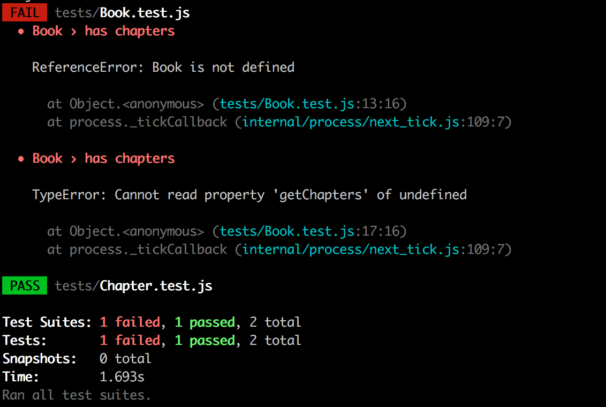
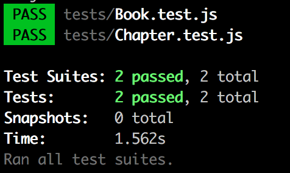

:twisted_rightwards_arrows: **Driver and Navigator switch roles if you haven't already done so**

## Book

```
As a person,
So I can keep track of where I've read to,
I would like to see a list of the chapters in a book.
```

Now we need to write a test - and eventually the code - for our chapter listing. We will pass in an array of `Chapter` objects as an argument to a `Book` constructor - there would be no point in a setter method as the chapters in a published book won't ever be added to. 

We will therefore just assume `Book` to be an object that takes an array of `Chapter` objects, and has a getter method `getChapters` that returns that array.

## Without the code samples - red and green

1. Create a new file in `/tests` called `Book.test.js`.

2. Inside the file, call `describe`, passing in `Book` as the first argument, and an anonymous function as the second argument.

3. In the `describe` callback, declare a new variable named `chapters` and assign to it an empty array. Also declare a variable named `book`, but don't assign to it.

4. Now in the `beforeEach`, create a `for` loop that will call the `push` method on the `chapters` array `12` times, passing in `new Chapter(path.join(__dirname, '/fixtures/sampleChapter.txt'))` as an argument (you will need to make sure you've `require`d in your `Chapter.js` file as well as the `path` module). 

5. Then, still inside the `beforeEach`, assign a `new Book` object to the `book` variable, passing in `chapters` to the constructor.

6. After the `beforeEach`, call the `test` method. Give it the description: `has chapters`.

7. Now create a new assertion, `expect`ing that the `getChapters` method on `book` will return the value of the `chapters` array.

8. If you've done everything correctly up to this point, then your test will fail with the following:



9. First write the code that will solve the error at the top of the stack trace `ReferenceError: Book is not defined`. Run the tests again. Then write the code that fixes the remaining error `TypeError: book.getChapters is not a function`. 

10. All green:



:twisted_rightwards_arrows: **Driver and Navigator switch roles**
