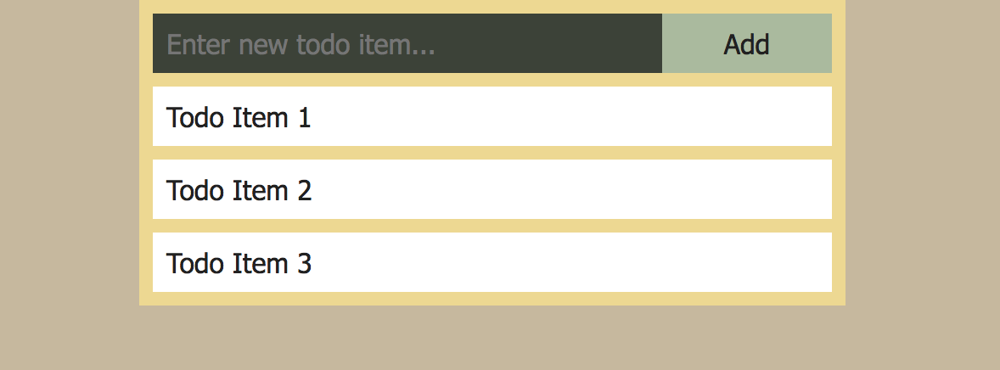

:twisted_rightwards_arrows: **Driver and Navigator switch roles if you haven't already done so**

## View

At the moment, our controller is responsible for the content being displayed on the page. This is against the MVC (model, view, controller) pattern, which dictates that view logic should be seperate. We're going to use a templating engine, which will not only allow us to keep our view logic in separate files, but will give us powerful helper functions that will enable us to perform conditional logic and loops inside of our HTML.

1. The templating engine we will be using is [Handlebars](http://handlebarsjs.com/). Somebody has done the hard work for us and has made Handlebars compatible with Express through the [express-handlebars](https://github.com/ericf/express-handlebars) module. Go ahead and install it with npm, saving to dependencies:

```js
npm install --save express-handlebars
```

2. Now on line 2 of `app.js` (after our `express` `require`), require in `express-handlebars` and assign it to a variable named `exphbs`:

```js
var exphbs = require('express-handlebars')
```

3. After the assignment to `app` - but before we require in `toDoController` - add the following:

```js
app.engine('.hbs', exphbs({
  extname: '.hbs',
  defaultLayout: 'main'
}))
app.set('view engine', '.hbs')
```

You don't need to remember the above (in future you can always look back to this walkthrough, or refer to the [express-handlebars docs](https://github.com/ericf/express-handlebars)), but we're essentially telling Express to use Handlebars to render templates, and that our template files end in `.hbs`.

4. Create a `views` folder in the project's root folder. 

5. Inside the `views` folder, create a `layouts` folder.

6. Inside the `layouts` folder, create a new file called `main.hbs`. Populate with the basic HTML structure (`!` `Tab`), change the title and add `{{{body}}}` in between the `body` tags:

```html
<!DOCTYPE html>
<html lang="en">
<head>
  <meta charset="UTF-8">
  <meta name="viewport" content="width=device-width, initial-scale=1.0">
  <meta http-equiv="X-UA-Compatible" content="ie=edge">
  <title>ToDo List</title>
</head>
<body>
  {{{body}}}
</body>
</html>
```

***
:bulb:

Above when we configured express-handlebars, we told it to use `main` as the `defaultLayout`. By default, `express-handlebars` will look inside `views/layouts` for the layout file. It will then **yield** the contents of any rendered templates to `{{{body}}}`. We essentially have a wrapper for all of our templates, which is helpful for when you don't want some parts of the page to change e.g. headers and footers.
***

7. Now inside `views/` create a file called `home.hbs`, add `Hello World!` and save.

8. Now back inside `toDoController.js`, change `res.send('Hello World!')` to `res.render('home')`:

```js
function todoController (app) {
  app.get('/', function (req, res) {
    res.render('home')
  })
}

module.exports = todoController
```

9. Again, if everything has worked well then you should still see `Hello World!` in your browser, but your page title should now have changed also, as you've sent a full HTML response to the browser (including a `title` tag).

## home.hbs

1. Please copy and paste the following into `views/home.hbs`:

```html
<form method="post">
  <input type="text" name="item" placeholder="Enter new todo item...">
  <button type="submit">Add</button>
</form>

<ul>
  <li>Todo Item 1</li>
  <li>Todo Item 2</li>
  <li>Todo Item 3</li>
</ul>
```

2. Create a `public` folder in your project root and inside it create a `css` folder.

3. Inside `css` create a file called `main.css` and copy and paste in the following:

```css
body {
  margin: 0;
  background-color: #C6B89E;
  font-family: 'Segoe UI', Tahoma, Geneva, Verdana, sans-serif;
  color: #212121;
}

#todo-list-wrapper {
  width: 400px;
  margin: 0 auto;
  background-color: #EDD892;
  padding: 0.5rem;
}

input, button {
  border: 0;
  margin: 0;
  box-sizing: border-box;
  font-family: inherit;
  font-size: 1rem;
  padding: 0.5rem;
  color: inherit;
  outline: none;
}

input {
  width: 300px;
  background-color: #3C4238;
  color: white;
}

button {
  width: 100px;
  background-color: #AABA9E;
}

ul {
  list-style-type: none;
  margin: 0;
  padding: 0;
}

ul li {
  margin: 0;
  margin-top: 0.5rem;
  padding: 0.5rem;
  background-color: #FFFFFF;
}

ul li:hover {
  background-color: #FCB97D;
  cursor: pointer;
  text-decoration: line-through;
}
```

4. Now inside `main.hbs` add a `link` tag to the `head`:

```html
<link href="css/main.css" rel="stylesheet">
```

5. Inside `app.js`, below the `app.set` add:

```js
app.use(express.static('public'))
```

***
:bulb:

Here we tell Express that our assets such as images, CSS and frontend JavaScript files will be stored in `public`. When our app runs, Express will bring these files out of the folder and into the root, so we can still access with `css/main.css` for example. 
***

6. Save and refresh the page. You should see:



## Add, commit and push

:twisted_rightwards_arrows: **Driver and Navigator switch roles**

[Next](lesson1_part3.md)