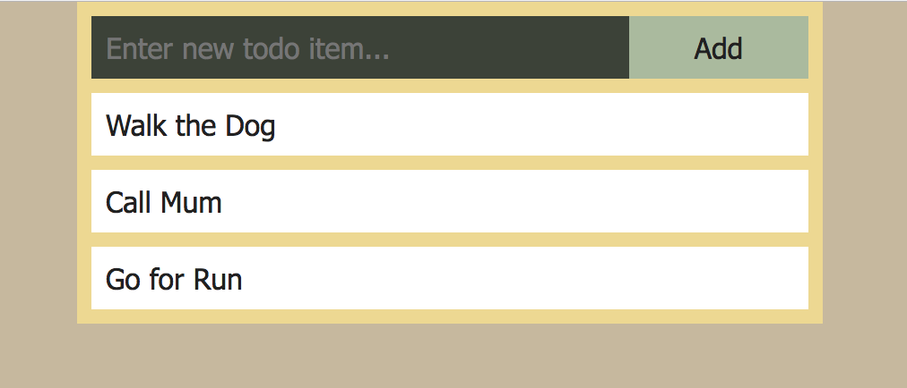

:twisted_rightwards_arrows: **Driver and Navigator switch roles if you haven't already done so**

## Model

At the moment our to-do items are static HTML. They don't come from a data source. We're eventually going to hook up a database to our to-do list, but for now we can use some mock data. 

1. Create a new folder called `models` in your project's root folder.

2. Inside `models` create a new file called `ToDos.js`. 

3. Create a constructor and prototype for `ToDos`:

```js
function ToDos () {

}

ToDos.prototype = {

}
```

4. Give ToDos an `_items` property and a getter method called `getItems` that returns the value of the property:

```js
function ToDos () {
  this._items = []
}

ToDos.prototype = {
  getItems: function () {
    return this._items
  }
}
```

5. Add a method to `ToDos` prototype called `addItem` that takes a parameter of `task`:

```js
ToDos.prototype = {
  getItems: function () {
    return this._items
  },
  addItem: function (task) {

  }
}
```

6. Each to-do needs to have its own unique identifier, so that when we delete to-dos later on, we don't delete another to-do with the same text. We can generate random IDs with the `random-id` module. Install it and save it to dependencies:

```bash
npm install --save random-id
```

7. At the top of `ToDos.js`, require in `random-id` and assign it to a variable named `randomID`:

```js
var randomID = require('random-id')
```

8. Now inside `addItem` we want to push an object into `_items` which has a property of `id` with a value of `randomID()`, and a property of `task` with a value of `task`:

```js
  addItem: function (task) {
    this._items.push({
      id: randomID(),
      task: task
    })
  }
```

9. Now underneath the prototype block, create a new instance of `ToDos` and add some items:

```js
var toDos = new ToDos()

toDos.addItem('Walk the Dog')
toDos.addItem('Call Mum')
toDos.addItem('Go for Run')
```

10. Finally, set the value of `module.exports` to `toDos` (we are exporting an instance of our ToDos constructor):

```js
module.exports = toDos
``` 

### Model to controller to view

Now we have all three aspects of MVC, we can really put our controller to work. 

1. Inside `toDoController.js`, require in `ToDos.js` and assign to a new variable named `toDos`:

```js
var toDos = require('../models/ToDos.js')
```

2. Pass a second argument to the `res.render` call of an object literal with a property `toDos` and a value of `toDos.getItems()`:

```js
res.render('home', {
  toDos: toDos.getItems()
})
```

***
:bulb:

The second parameter of `res.render` is the data we wish to pass into the template. We will now have access to `toDos` inside of `home.hbs`.
***

3. Now inside `home.hbs`, remove all `li` tags, so you're just left with `ul` tags:

```html
<div id="todo-list-wrapper">
  <form method="post">
    <input type="text" name="item" placeholder="Enter new todo item..."><button type="submit">Add</button>
  </form>

  <ul>

  </ul>
</div>
```

4. Now we're going to use the `each` Handlebars helper to loop through our `toDos` array. The syntax is as follows:

```html
  <ul>
    {{#each toDos}}

    {{/each}}
  </ul>
```

5. Inside the `each` block, we can access our object's properties by specifying their names inside of double curly braces (i.e `{{id}}` and `{{task}}`). Add opening and closing `li` tags, and in-between add `{{task}}`:

```html
  <ul>
    {{#each toDos}}
      <li>{{task}}</li>
    {{/each}}
  </ul>
```

***
:bulb:

Handlebars is very powerful. Read more about its [built-in helpers](http://handlebarsjs.com/builtin_helpers.html).
***

6. Finally, we want our list items to have an `id` attached to them so we can delete them when clicked. Add a `data-id` attribute to the opening `li` tag and give it a value of ``{{id}}``:

```html
  <ul>
    {{#each toDos}}
      <li data-id="{{id}}">{{task}}</li>
    {{/each}}
  </ul>
```

***
:data:

Any attribute with a name beginning with `data-` is referred to as a data attribute. When we trigger an event on the element, we can access its attributes values on the `dataset` property. [Read more on MDN](https://developer.mozilla.org/en-US/docs/Learn/HTML/Howto/Use_data_attributes).
***

7. Inside your browser, you should now see the to-do items you specified in your model:



## Add, commit and push

:twisted_rightwards_arrows: **Driver and Navigator switch roles**

[Next](lesson1_part4.md)